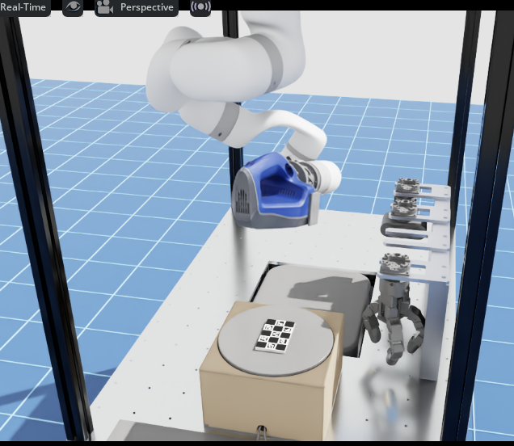
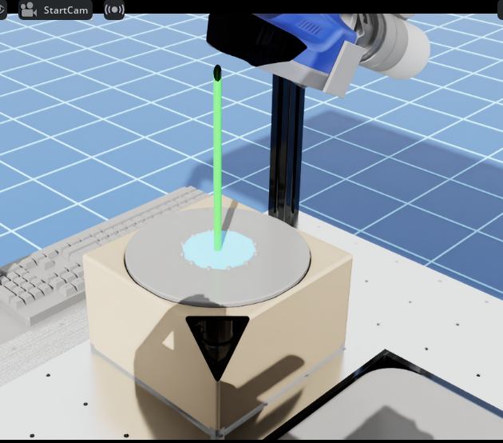

# Calibration — Hand-Eye(`T_EC`) · Turntable(`T_B_F0`)

> MMS 의 두 가지 캘리브레이션을 다룬다. 원리와 근거가 필요할 때 참조하며,
> **손으로 따라 할 절차만 필요하면 `calibration_runbook.md`** 를 본다.
>
> - **Part 1 — `T_EC`**: 카메라가 로봇 손목에 부착된 관계
> - **Part 2 — `T_B_F0`**: 턴테이블의 위치와 회전축
> - **Part 3 — 전체 순서**: 위 둘 + 충돌 모델 반영. **바쁘면 Part 3 만 읽어도 된다.**
>
> 결과가 이상하면 부록(T1~T8)을 먼저 확인한다.
>
> **검증 상태** — sim 에서 GT 대비 목표치를 충족한다. 실물은 `T_EC`·`T_B_F0` 모두
> 2026-09-16 에 재취득하였다. **실물 독립 검증은 미작성**(T7).

---

## 0. 판정 기준

캘리브레이션은 선택이 아니라 해를 구하는 단계이므로, 판단은 "결과를 수용할 것인가"
하나다.

| 대상 | 기준 | 목표치 | 위치 |
|---|---|---|---|
| `T_EC` (sim) | GT 대비 병진·회전 오차 | `t < 5mm` · `r < 2°` | `solve_and_report` → T5 |
| `T_EC` (real) | GT 가 없으므로 calibrator 잔차 + point-consistency | `< 0.5mm` | 🔬 미작성 (T7) |
| 자세 집합 충분성 | 병진이 수렴하지 않으면 대개 **회전 다양성 부족**이다. `t_err` 만 크고 `r_err` 가 작으면 이 경우다 | — | T3 |
| `T_B_F0` | rim 원 피팅 잔차 RMS, 점의 원주 분포 | 실측 0.19mm / 22점 | `turntable_frame.fit` |
| 원점 높이 | 원 피팅은 축과 중심만 제공하므로 표면 평면으로 별도 확정한다 | — | §7 |

> **잔차가 작아도 축 방향이 정확하다는 보장은 없다.** 점이 원주 한쪽에 편중되면
> 중심은 잘 잡히고 **평면 법선만 크게 어긋난다.** rim 점은 원주 전체에 고르게 취득한다.
> (2026-09-21 재취득 후 축 기울기는 base z 대비 1.4° 다.)

---

# 〔Part 1〕 Hand-Eye — `T_EC`

## 1. 대상과 규약

| 프레임 | 의미 |
|---|---|
| **B** | 로봇 base (월드) |
| **E** | EE = 플랜지 = 손목 끝 (스캐너 마운트) |
| **C** | 카메라 광학 프레임 |
| **M** | 마커(보드) 프레임 |

구하려는 값은 `T_EC`, 즉 카메라가 손목에 부착된 고정 관계다. 센서를 교체하거나 재설치하기
전까지 불변이므로 `config/sensor_frames.yaml::T_EC_artec` 에 저장하여 사용한다.

> **규약을 틀리면 전체가 어긋난다.** `T_EC` 는 **E→C** 방향이다(`x_C = T_EC · x_E`).
> 규약의 출처는 `utils/transforms.py::compute_T_CB` (`T_CB = T_EB · inv(T_EC)`) 다.

---

## 2. ChArUco 보드

캘리브레이션의 출발점은 실물 보드이며, 여기서 어긋나면 이후 수치가 모두 무의미해진다.


```bash
conda activate mms-env && cd "$MMS_ROOT"
env -u PYTHONPATH python scripts/artec/make_charuco.py --pdf     # spider_dense (기본)
```

출력은 `debug_calib/charuco_<sx>x<sy>_<sq>_<mk>.png`(+`--pdf` 시 `.pdf`)다.

| 프리셋 | 칸 구성 | square / marker | 실물 크기 | 내부 코너 | 비고 |
|---|---|---|---|---|---|
| **`spider_dense`** | 7×5 | 12 / 9mm | **84×60mm** | **24** | **기본** |
| `spider` | 5×3 | 20 / 15mm | 100×60mm | 8 | 구 기본. 잘림에 취약 |
| `spider_small` | 5×3 | 16 / 12mm | 80×48mm | 8 | 근접 관측용 |
| `a4` | 7×5 | 30 / 22mm | 210×150mm | 24 | 광각용. **Spider 에는 부적합** |

프리셋은 `mms_artec/utils/calibration/artec_charuco_detector.py::BOARD_PRESETS` 한 곳에서만
정의하며, 검출기·보드 생성·자세 생성·캘리브가 이를 공유한다.

**`spider_dense` 를 사용하는 이유** — Spider 는 FOV 가 좁다(실측 K 기준 가로 21.8° /
세로 29.2°, standoff 320mm 에서 화각 123×167mm). 구 `spider` 는 시야에 들어가기는 하나
내부 코너가 8개뿐이어서 일부만 잘려도 해가 구해지지 않는다(실측: 15장 전부 모서리 2/4 가
프레임 밖, 검출 코너 4~6개). `spider_dense` 는 코너가 24개이고 보드도 작아 가로 여유가
11.7 → 19.5mm 로 증가한다.

### 인쇄

> **배율 100%, "용지에 맞춤" 해제.** 이 옵션이 켜져 있으면 칸 크기가 달라지고, 검출은
> 정상으로 보이는데 `T_MC` 의 스케일이 어긋나 결과가 조용히 틀어진다.

**`--pdf` 로 생성한 A4 PDF 인쇄를 권장한다.** PNG 를 직접 인쇄하면 뷰어가 DPI 를 임의로
가정하여 배율이 변동한다(실측: 84mm 보드가 A4 를 채워 칸이 12 → 29mm). PDF 에는 100mm
검증 자가 함께 인쇄된다.

인쇄 후 자로 실측한다. 여러 칸을 한 번에 재는 것이 정확하다 — `spider_dense` 는 가로
7칸이 84mm, 세로 5칸이 60mm 다. 공칭과 다르면 그 값을 전달한다.

```bash
env -u PYTHONPATH python scripts/artec/calibrate.py --only 2 -- --square-mm 19.8
```

기본 해상도는 10 px/mm(254 DPI)이며, 12mm 칸과 같이 작은 보드는 `--pixels-per-mm 20`
(508 DPI)을 권장한다.

### 부착과 배치

- **평평하고 단단한 판에 전면 접착한다.** 종이가 휘면 `solvePnP` 가 그 왜곡을 자세
  오차로 산출한다.
- **광택 없는 용지**를 사용한다. 코팅지는 조명 반사로 코너 검출이 실패한다.
- **턴테이블 원판 위에 배치한다.** hand-eye 완료 후 동일 조준 자세에서 턴테이블
  캘리브레이션으로 연속 진행할 수 있어 수동 조준이 1회로 끝난다.
- 반구 자세로 기울여도 보드 전체가 시야에 유지되는 위치에 둔다.

---

## 3. 전체 흐름

```
                    ┌─────────────── 자세 i = 1..N 반복 ───────────────┐
  [준비]            │                                                   │   [풀이]
  보드 고정    ──►  │  ① 로봇을 다양한 자세로 이동                       │ ──► add_sample 을
  K(intrinsic) 확보 │  ② 카메라 캡처                                     │     calibrateHandEye
                    │  ③ ChArUco 검출 + solvePnP → T_MC (보드→카메라)    │     → T_EC
                    │  ④ 로봇 FK → T_BE                                  │
                    │  ⑤ add_sample(T_BE, T_MC)                          │
                    └───────────────────────────────────────────────────┘
```

**①~⑤와 풀이는 sim·real 이 동일한 라이브러리 코드를 사용한다.** 차이는 자세 생성과
캡처 방식뿐이다.

| 단계 | 담당 | real | sim |
|---|---|---|---|
| ① 자세 생성 | `generate_hemisphere_poses` | `gen_calib_poses.py` → yaml 순회 | 반구 자세 생성 |
| ① 자세 이동 | `RobotIK.ik` | xArm SDK 모션 명령 | 관절공간 구동 |
| ② 캡처 | — | Artec 실기 | Isaac 카메라 렌더 |
| ③ 검출 | `ArtecCharucoDetector.detect` → `T_MC`(mm) | 공통 | 공통 |
| ④ FK | — | `XArmInterface.get_ee_pose_mat` | `rigid_ee` |
| ⑤ 누적 · 풀이 | `HandEyeCalibrator` | 공통 | 공통 |

자세 생성은 real 도 공유 코드를 사용한다. `gen_calib_poses.py` 가
`generate_hemisphere_poses` 를 호출하여 `artec_calibration_poses.yaml` 을 생성하고,
캘리브 스크립트가 그 목록을 순회한다. **teach mode(수동 기록)는 제거되었다.**

기준점은 두 가지로 설정한다.

- `--from-view` (권장) — 현재 보이는 ChArUco 를 검출하여 그 보드 위에 반구를 구성한다.
  **동일한 `T_EC` 로 검출하고 겨냥하므로 `T_EC` 의 계통 오차가 1차 상쇄된다.** 따라서
  `T_EC` 가 낡아도 동작한다.
- `--hint-xy` / `--center` — 셀 모델의 턴테이블 원판 기준. `T_EC` 와 무관하게 오프라인
  생성이 가능하다.

---

## 4. 실행 — hand-eye 단독

전체를 새로 취득하는 경우에는 **Part 3** 을 사용한다. 아래는 hand-eye 만 재취득하거나
sim 으로 검증할 때다.

### real

```bash
conda activate mms-env && cd "$MMS_ROOT"
env -u PYTHONPATH python scripts/artec/calibrate.py --only 1   # 카메라 K
env -u PYTHONPATH python scripts/artec/calibrate.py --only 2   # 자세 순회 → T_EC

# 인자 전달은 `--` 뒤에
env -u PYTHONPATH python scripts/artec/calibrate.py --only 2 -- \
    --poses config/calibration/artec_calibration_poses.yaml
```

결과는 `config/sensor_frames.yaml::T_EC_artec` 에 반영된다. 자세 15~25개, 자세 간 회전
**30° 이상**을 확보한다(T3). 실물 기준값은 **t_err 3.55mm / r_err 1.30°** 다.

### sim 검증

```bash
ISAAC=~/miniconda3/envs/env_isaacsim/bin/python
env -u PYTHONPATH $ISAAC -u scripts/sim/calib_handeye_sim.py           # 헤드리스
env -u PYTHONPATH $ISAAC -u scripts/sim/calib_handeye_sim.py --gui     # 화면 표시
```



*로봇이 스캐너를 들고 턴테이블 위 보드를 반구 자세로 순회하며 촬영한다. 우측은
툴체인저 스탠드로, 충돌 게이트가 배제하는 대상 중 하나다(T4).*

| 옵션 / 환경변수 | 기본 | 내용 |
|---|---|---|
| `--gui` | 꺼짐 | Isaac 창 표시 |
| `--max-steps N` | 20000 | update 상한 (정상 완주 약 2400) |
| `--out DIR` | `scripts/sim/log/handeye` | 산출물 위치 |
| `MMS_MOVE_RAMP` | 90 | 이동 램프. 키우면 저속 이동 |
| `MMS_CALIB_POLARS` / `AZIS` | `0,15,30,45` / 8방위 | 자세 구성 (T3) |
| `MMS_CALIB_COLLISION` | 1 | 충돌 게이트 (T4) |
| `MMS_SETTLE_TOL` | 0.045 rad | 관절 수렴 허용오차 (T7) |

Isaac GUI Script Editor 로 구동하려면 `sim_harness/MMS_ext_calibration.py` 를 사용한다.
해당 하니스는 **standalone 실행이 불가능하다**(T6).

---

# 〔Part 2〕 Turntable — `T_B_F0`

## 5. 대상과 규약

| 프레임 | 의미 |
|---|---|
| **F** | 턴테이블 프레임 (원점 = 회전축이 disc 표면과 만나는 점, z = 회전축) |

`T_B_F0` 는 턴테이블의 위치와 회전축을 base 기준으로 표현한 값이며, 하드웨어를 이설하기
전까지 불변이므로 `config/calibration/turntable_frame.yaml` 에 저장한다.
규약은 **B→F** 방향이다(`x_F = T_B_F0 · x_B`).

nbv 조준, NBV 계획, 추적 상실 복구, 충돌 회피가 모두 이 값에 의존한다. 하드웨어 이설
시 전부 무효가 되므로 재취득 절차를 단순하게 유지하는 것이 중요하다.

## 6. Rim 피팅

회전판에 고정된 점은 회전축 둘레로 원을 그리므로, 원의 법선이 축 방향이고 중심은 축 위의
한 점이다. disc 가장자리(rim)가 곧 축 둘레의 원이므로, rim 위의 점을 3D 로 취득하여
원을 피팅하면 축을 얻는다.

```
로봇이 disc rim 을 관측하는 자세 → 1회 캡처 (organized 점군 + T_CB)
        ▼
   rim 점 취득   real: 사용자가 3점 이상 클릭 / sim: disc 기하로 자동 추출
        ▼
   pts_B → fit_circle_3d → (center, normal, radius, residual)
        ▼
   (+ 표면 평면, §7) → build_T_B_F0
```

카메라 위치는 로봇이 제공한다. 점군은 `센서 C → T_CB(= T_EC·FK) → base` 경로로 변환하며
Artec 의 SLAM 은 사용하지 않는다. hand-eye 와 동일한 방식이다.

| 함수 | 역할 |
|---|---|
| `rim_picker.RimPicker(intensity, organized_pts, T_CB)` | OpenCV 클릭 UI. 좌클릭 추가 / 우클릭 취소 / Enter 피팅. 픽셀→base 변환 내장 |
| `rim_picker.show_3d_result(...)` | Open3D 로 결과 확인 |
| `turntable_frame.fit_circle_3d(pts)` | 평면 SVD + 2D 원 피팅 → `(center, normal, radius, residual)` |

> Spider 는 FOV 가 좁아 rim 전체가 한 화면에 들어오지 않을 수 있다. 이 경우 보이는
> 호(arc)에서 취득한다. 원 피팅은 3점이면 성립하나 호가 짧으면 조건수가 악화된다.

## 7. 표면 평면으로 원점 확정

원 피팅이 제공하는 것은 축의 방향과 XY 위치뿐이다. 좌표계를 세우려면 원점 높이가
필요한데, rim 궤적의 높이가 disc 표면 높이와 일치한다는 보장이 없다. 따라서 disc
표면 평면을 별도로 피팅하고, 그 평면과 축선의 교점을 F 프레임 원점으로 삼는다.
이 높이는 충돌 회피와 대상물 높이 기준으로 사용된다.

F 프레임의 원점은 표면 위의 축점, z축은 축 방향, x축은 base x축을 해당 평면에 투영한
것, y축은 z×x 다.

| 함수 | 역할 |
|---|---|
| `turntable_frame.fit_plane(pts)` | 표면 평면 SVD 피팅 |
| `turntable_frame.build_T_B_F0(center_B, nz_B)` | 위 정의대로 F 프레임 구성 |
| `turntable_frame.save_turntable_frame_yaml(...)` | translation(m) + quaternion 저장 |

## 8. 실행 — 턴테이블 단독

```bash
env -u PYTHONPATH python scripts/artec/calibrate.py --only 3   # rim 클릭
```
→ `config/calibration/turntable_frame.yaml`, 기준값 **0.015° / 0.7mm**

### sim 검증

Isaac python 의 cv2 는 headless 빌드라 클릭 창을 표시할 수 없으므로, 캡처와 클릭을
분리한다.

```bash
ISAAC=~/miniconda3/envs/env_isaacsim/bin/python

# 자동 — rim 점을 기하로 합성. 축 방향 검증용
MMS_ISAAC_HEADLESS=1 MMS_RIM_AUTO=1 env -u PYTHONPATH $ISAAC scripts/sim/calib_rim_sim.py

# 수동 클릭 — 실물 절차와 동일
env -u PYTHONPATH $ISAAC scripts/sim/calib_rim_sim.py       # 1) 캡처
env -u PYTHONPATH python scripts/sim/rim_click_offline.py   # 2) 클릭·피팅·저장
```

| 환경변수 | 기본 | 내용 |
|---|---|---|
| `MMS_RIM_AUTO` | 0 | 1 = rim 점 자동 합성 |
| `MMS_ISAAC_HEADLESS` | 0 | 1 = 창 없이 수치만 |
| `MMS_RIM_R` / `_N` | 0.05 m / 12 | 자동모드 합성 rim 반경·점 수 |



*검증 시각화. 초록이 GT 축, 마젠타가 추정 축이다. 축 방향오차가 0.012° 라 육안으로는
겹쳐 보인다. **축 정확도는 이 그림으로 확인**하고 중심 오차는 로그 수치로 판단한다.*

> ⚠ 자동모드는 실제 rim(119mm)이 아니라 합성 링(50mm)을 피팅하므로 **중심 오차가 크다**
> (2.5mm). 축 방향 검증용으로만 사용하고 중심 정확도는 실기에서 확인한다 → **T8**

---

# 〔Part 3〕 전체 캘리브레이션

## 9. 실행 순서

```bash
conda activate mms-env && cd "$MMS_ROOT"

env -u PYTHONPATH python scripts/artec/calibrate.py           # 전체
env -u PYTHONPATH python scripts/artec/calibrate.py --from 2  # 2단계부터
env -u PYTHONPATH python scripts/artec/calibrate.py --only 3  # 3단계만
env -u PYTHONPATH python scripts/artec/check_calibration.py   # 완료 후 검산
```

| 단계 | 내용 | 산출 |
|---|---|---|
| **0** | **수동 조준** — 보드를 원판 위에 올리고 보드와 rim 이 함께 시야에 들어오게 정렬 | — |
| **1** | intrinsic — 카메라 K (최초 1회) | `artec_intrinsic.yaml` |
| **2** | hand-eye — `T_EC` | `sensor_frames.yaml::T_EC_artec` |
| **3** | turntable — `T_B_F0` | `turntable_frame.yaml` |
| **4** | 충돌 모델 — `T_B_F0` 를 셀 캐시에 반영 | `utils/collision/data/cell_env.npz` |

`calibrate.py` 는 자체 로직 없이 각 스크립트를 순서대로 호출하고 실패 시 중단한다.

### 4단계가 캘리브레이션에 포함되는 이유

로봇이 실제로 회피하는 대상은 yaml 이 아니라 **충돌 캐시(`cell_env.npz`)가 결정한다.**
3단계에서 중단하면 yaml 은 새 값, 캐시는 이전 턴테이블 위치가 되어 충돌 게이트가 잘못된
위치를 검사한다.

4단계(`rebuild_from_calib.py`)는 캐시 내의 **턴테이블 점군만** 새 위치로 강체 변환한다.
테이블·벽은 이동하지 않았으므로 그대로 둔다. 장비도 Isaac 도 필요하지 않다.

```
[4] 충돌 모델 — 캘리브된 턴테이블 자리 반영
  캐시 기준 축 (meta) : 원점 [0.7992 0.0053 0.6883]
  캘리브  축          : 원점 [0.8592 0.0053 0.6883]
  차이                : 60.0 mm · 축 0.00°
  게이트 사각: 7.5% → 0.0%
  ✓ 캐시 갱신
```

> **`cell_env.meta.yaml` 이 핵심이다.** 캐시는 점군일 뿐이므로 어느 점이 턴테이블인지
> 자체적으로 알 수 없다. meta 의 `T_B_F0_at_bake` 가 캐시 생성 시점의 턴테이블 위치를
> 기록하며, 미세조정은 이 값으로 이전 위치를 파악한다. meta 가 없으면 캐시에서 원판을
> 추정하는데 정확도가 떨어진다(실측: 60mm 어긋남을 53mm 로 추정).

### 검산

```
교차검증 — 활성 레이아웃 'v2_real_260917' 기준 게이트 사각 0.3% · p99 20mm
[OK]   충돌 캐시가 캘리브된 턴테이블을 덮고 있다
```

**게이트 사각 %** 는 캘리브된 원판면 중 캐시에 충돌여유(25mm) 내 물체가 없는 면적
비율, 즉 "실제 턴테이블이지만 게이트가 인식하지 못하는 영역"이다. 거리(mm)로 측정하면
횡방향 이동을 검출하지 못한다 — 원판이 지름 243mm 평면이라 50mm 이동해도 대부분의 점이
원판 위 어딘가에 근접하기 때문이다.
판정은 `<1%` OK · `<8%` WARN · 그 이상 FAIL 이다.

### 셀 형상이 변경된 경우

턴테이블뿐 아니라 셀 형상 자체가 변경된 경우(테이블·벽·툴스탠드 이동, 로봇 마운트 변경,
CAD 갱신)는 4단계 미세조정으로 해결되지 않으며 USD 를 다시 생성해야 한다.

```bash
python scripts/sim/build_scene_v2_real.py --out <새 씬.usd>
python scripts/collision/bake_layout.py --scene <새 씬.usd> --alias v2_real_261015
python scripts/collision/bake_layout.py --list     # 레이아웃 목록
python scripts/collision/use_layout.py <별칭>      # 전환
```

**Isaac Sim 파이썬과 USD 자산이 필요하다.** 현장 PC 에 없으면 자산이 있는 PC 에서 생성한
`cell_env.<별칭>.npz` 를 `utils/collision/data/layouts/` 에 복사하고 `use_layout.py` 로
전환한다.

전제조건 미충족으로 4단계를 수행하지 못하면 `STALE_COLLISION.txt` 표식이 남고
`check_calibration.py` 가 매번 이를 보고한다.

> **`T_EC` 가 `T_B_F0` 에 선행하는 이유는 현재 구현 기준이다.** `turntable_calib.py` 는
> rim 점을 base 로 변환한 뒤 피팅하며(`T_CB = T_EB · inv(T_EC)`), 그 변환에 `T_EC` 가
> 필요하다. 원리적 제약은 아니다 — 카메라 프레임에서 그대로 피팅하면 순서를 뒤집을 수
> 있다(T8 말미).
>
> 보드를 원판 위에 두면 2→3 을 동일 조준 자세에서 연속 수행할 수 있어 0단계가 1회로 끝난다.

---

## 10. 코드 지도

**공유 라이브러리 (sim·real 공통)**

| 파일 | 역할 |
|---|---|
| `utils/calibration/hand_eye_calibrator.py` | `add_sample(T_EB, T_MC)` / `calibrate()→T_EC`. 5-method 중 잔차 최소 채택 |
| `utils/calibration/handeye_sim.py` | sim 검증 공통 — 보드 규격·자세 생성·풀이·GT 비교 |
| `utils/calibration/turntable_frame.py` | **턴테이블 공유 코어** — `fit_circle_3d` / `fit_plane` / `build_T_B_F0` / `axis_error` |
| `utils/calibration/rim_picker.py` | rim 클릭 UI |
| `mms_artec/utils/calibration/artec_charuco_detector.py` | `CharucoBoardSpec` / `detect()→T_MC`(mm) |
| `mms_artec/utils/calibration/handeye_geometry.py` | SE3 수학 + `generate_hemisphere_poses` |
| `utils/robot/xarm7_kinematics.py` | 해석 FK/IK (수치 DLS) |
| `utils/collision/collision_model.py` | 충돌·특이점 게이트 (메시 SDF) |
| `utils/transforms.py` | `compute_T_CB` — ★ `T_EC` 규약의 출처 |

**실물 파이프라인**

| 파일 | 역할 |
|---|---|
| `scripts/artec/calibrate.py` | **단일 진입점** — 아래를 순서대로 호출 |
| `scripts/artec/make_charuco.py` | 보드 생성 (§2) |
| `scripts/artec/gen_calib_poses.py` | 자세 목록 생성 → `artec_calibration_poses.yaml` |
| `scripts/artec/intrinsic_calib.py` | 카메라 K (1회) |
| `scripts/artec/hand_eye_calib.py` | 자세 순회 → detect → add_sample → calibrate → save |
| `scripts/artec/turntable_calib.py` | rim 클릭 (`ARTEC_TO_OPENCV` z-flip + `T_CB`) |
| `scripts/artec/check_calibration.py` | 캘리브 ↔ 충돌 캐시 교차검증 |

**sim 검증**

| 파일 | 역할 |
|---|---|
| `scripts/sim/calib_handeye_sim.py` | standalone 러너 |
| `scripts/sim/calib_rim_sim.py` + `rim_click_offline.py` | 턴테이블 축 (캡처 / 클릭 2단계) |
| `sim_harness/MMS_ext_calibration{,2}.py` | GUI 드라이버 (Isaac 전용) |

---

# 〔부록〕 규약·함정

## T1. 좌표 규약

| 항목 | 규약 |
|---|---|
| `T_EC` | **E→C** (`x_C = T_EC·x_E`). calibrator 반환값도 동일 |
| `T_B_F0` | **B→F** (`x_F = T_B_F0·x_B`) |
| sim GT | `inv(T_W_C) @ T_W_E`. **역으로 잡으면 결과가 정상인데도 오차로 보인다** |

USD/Isaac 과 OpenCV 는 카메라 프레임 규약이 다르다. USD 는 광축이 −Z, +Y 가 위쪽이고
OpenCV 는 광축이 +Z, +Y 가 아래쪽이다. 차이는 `R_FLIP = diag(1, −1, −1)` 로 표현된다.

```
T_EC_usd = R_FLIP @ T_EC_ocv      ← 카메라가 출력측이므로 왼쪽 곱
```

실물에는 USD 가 없으므로 이 flip 은 **sim 검증 전용**이다.

## T2. 단위

| 값 | 단위 |
|---|---|
| `T_BE` translation | **m** |
| `T_MC` translation | **mm** (보드 사양이 mm → solvePnP tvec 도 mm) |
| `organized_pts` | **mm** |
| 저장 yaml | **m** |

`add_sample` 이 내부에서 `T_MC` 를 mm→m 로 변환한다.

## T3. 자세 부족 또는 편중

병진 정확도는 **자세 간 회전 다양성**에 좌우된다. 거의 수직으로만 내려다보면 회전축이
유사해져 병진이 부정확해진다. 충돌 게이트가 자세를 배제하므로 후보를 넉넉히 생성한다.

| 구성 | 생성 | 유효 | t_err | r_err |
|---|---|---|---|---|
| (0,12,22)×5 (구 기본) | 11 | 11 | 1.10mm | 0.15° |
| (0,15,30)×8 | 17 | 13 | 1.13mm | 0.16° |
| **(0,15,30,45)×8** | **25** | **15** | **0.95mm** | **0.10°** |

조정: `MMS_CALIB_POLARS` · `AZIS` · `ROLLS` · `JITTER` · `DIST`

> sim 은 검출 잡음이 없어 11 자세로도 수렴하나, **실물은 회전 다양성이 더 중요하다**
> (실측 3.55mm). 실기에서는 자세를 아끼지 않는다.

## T4. 충돌·특이점 게이트

생성한 자세를 구동 전에 검사하며, IK 해가 존재해도 충돌하면 배제한다.

| 검사 | 로그 예시 |
|---|---|
| 자가충돌 | `self(tool↔link3,0mm)` |
| 환경충돌 | `env(link4,0mm)` |
| 특이점 | `singular(σ=0.020<0.050)` |
| 이동 경로 | `이동경로 충돌 — ...` |

메시 SDF 기반이며 캐시 `utils/collision/data/{cell_env,xarm7_spider_links}.npz` 를 읽는다.
**캐시가 없으면 게이트가 조용히 비활성화되므로** 로그의 `충돌 게이트: ON` 을 확인한다.
해제는 `MMS_CALIB_COLLISION=0`.

> `start(...)` 사유는 출발 자세가 이미 여유 밖이라는 의미다. 하니스는 경고만 남기고
> 이동한다 — 거부하면 이후 전부가 동일 사유로 차단되는 연쇄가 발생한다.

## T5. 결과 해석 (sim)

`solve_and_report` 가 GT 대비 t_err(mm) / r_err(°) 를 출력하고
`captures_calib/handeye_result.npz` 를 남긴다.

| 증상 | 의심 원인 |
|---|---|
| `t_err` 는 큰데 `r_err` 는 작음 | 자세 회전 다양성 부족 → T3 |
| 검출 실패 다수 | 자세가 과도하게 비스듬하거나 보드가 시야 이탈 |
| 정상으로 보이는데 오차가 큼 | 프레임 flip 누락 → T1 |

## T6. sim 실행

- **하니스는 standalone 이 아니다.** `sim_harness/MMS_ext_*.py` 는 Isaac GUI 내에서만
  동작한다. 터미널 실행에는 `scripts/sim/calib_handeye_sim.py` 를 사용한다.
- **`utils` 패키지명 충돌** — Isaac 런타임에 동명 `utils` 가 있어 `from utils...` 가
  실패한다. MMS 모듈을 파일경로로 로드하며(`sys.modules` 등록 필수), 이동 대상 모듈은
  레포 내부 import 가 없는 자기완결 구조여야 한다.
- 종료 시 출력되는 `Task was destroyed but it is pending!` 등은 Isaac 위젯 정리 과정의
  로그이며 결과와 무관하다.

## T7. 알려진 문제

- ⚠ **드라이브 계통 오차** — 완전 정지 후에도 목표 대비 joint1 +1.4° / joint2~7
  +0.45~0.8° 가 잔존한다. 게인을 100배 높여도 joint1 은 불변이므로 제어 문제가 아니며
  **원인은 미규명**이다. hand-eye 는 실측 EE 자세와 실측 영상을 쌍으로 사용하므로 결과에
  영향은 없다. `MMS_SETTLE_TOL` 로 불필요한 타임아웃만 방지한다.
- ⚠ **`_RimPicker` 중복** — 원 피팅·`T_B_F0` 구성·yaml 저장은 공유 코어로 통일했으나 rim
  클릭 UI 만 Artec 판이 별도다. 입력 형식이 다르기 때문이며(공유 판은 정렬 점군, Artec 은
  메시), 어댑터를 작성하면 통일 가능하다.
- ⚠ **IK** — real·sim 모두 `xarm7_kinematics`(수치 DLS)를 사용한다. xArm SDK IK 는 컨트롤러
  통신이 필요하고 불안정하여 미사용이며, 모션 명령만 SDK 를 경유한다.
- 🔬 **hand-eye 검증 스크립트 미작성** — 캘리브에 사용하지 않은 별도 자세에서
  point-consistency 를 측정한다. 목표 < 0.5mm.

## T8. sim 자동모드 rim 중심 오차

자동모드는 실제 rim(119mm)이 아니라 합성 링(기본 50mm)을 피팅한다. Spider 의 작동거리
(0.2~0.3m)에서 원판 전체가 시야에 들어오지 않기 때문이다.

| r (m) | n | 축 오차 | 중심 오차 |
|---|---|---|---|
| **0.05** | 12 | **0.012°** | **2.549mm** |
| 0.05 | 24 | 0.012° | 2.547mm |
| 0.08 · 0.11 | — | 실패 — FOV 밖 | — |

축 방향은 정확하나 중심이 2.5mm 벗어난다. 점을 2배로 늘려도 감소하지 않으므로 잡음이
아니라 **계통 오차**이며, 합성 링 점을 정렬 점군에서 최근접 픽셀로 되읽는 과정의
양자화로 추정된다.

**실물 절차는 이 한계를 받지 않는다.** 사람이 실제 rim(119mm) 위를 클릭하므로 조건수가
훨씬 우수하다. 2.5mm 는 sim 자동모드의 아티팩트이지 방법 자체의 정확도가 아니다.

> **순서 역전 가능성 (미구현).** rim 클릭은 원래 카메라 프레임 점을 제공하므로
> (`pixel_to_3d_C`), base 로 옮기지 않고 그대로 피팅하면 자세마다
> `T_BE(i)·T_EC·c_C(i) = c_B` (3식) 와 `R_BE(i)·R_EC·n_C(i) = n_B` (2식) 이 성립한다.
> 미지수 11개에 자세당 5식이므로 3 자세 이상이면 `T_EC` 와 `T_B_F0` 가 동시에 구해진다.
>
> 그럼에도 ChArUco 를 사용하는 이유는 관측 자유도(5 vs 6), 자동 검출 가능 여부,
> 솔버 구현 여부, 중심 정확도에서 모두 ChArUco 가 우위이기 때문이다. 가능하지만
> 더 약하고 번거로운 경로이므로 선택지로만 남긴다.
