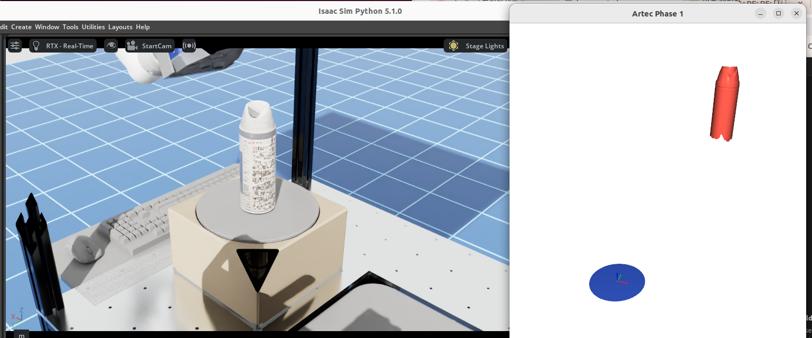
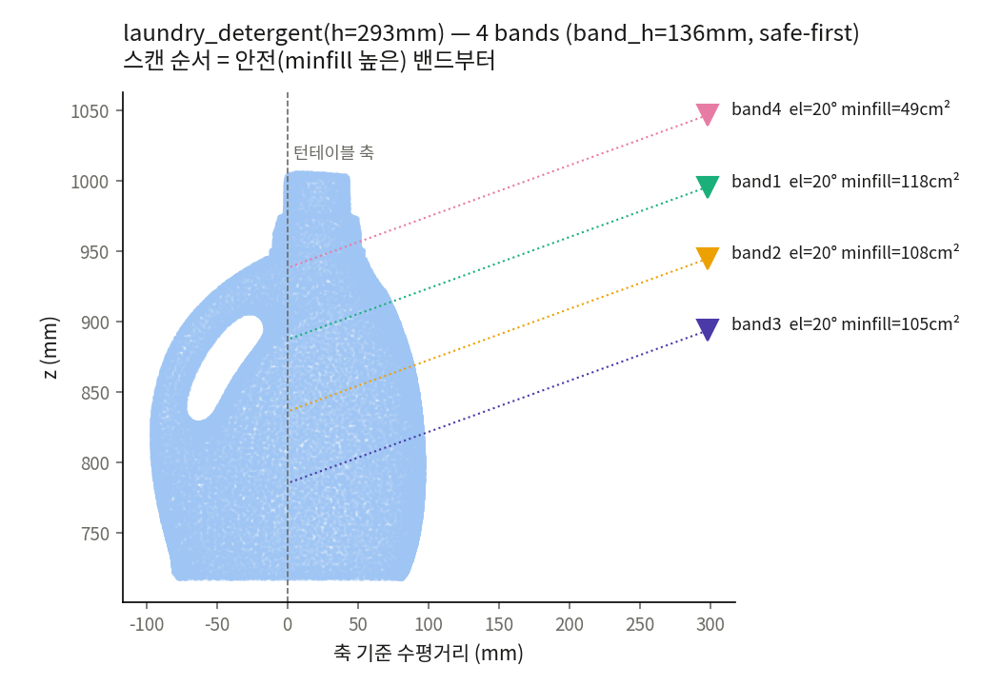

# Phase 1 — 5면 스캐닝 (streaming SLAM)

> 턴테이블이 한 바퀴 도는 동안 Spider 가 연속 스캔으로 윗면과 옆면 4개, 합쳐서 5면을
> 취득한다. 바닥면은 원판에 닿아 있어 얻을 수 없으므로 Phase 3(뒤집기)의 몫이다.
>
> 앞 단계는 `1_calibration.md`, 부족면 보강은 `3_phase2.md` 를 본다.
>
> **통합만 필요하다면 §3(sim·real 차이)과 §4(실행)까지만 읽어도 된다.** §5 이후는
> 자세 선정·밴드 분할·추적 감시의 원리와 코드 지도다.
>
> **결과가 이상하면 맨 뒤 〔부록〕 Troubleshooting 을 먼저 본다.** 규약·함정·알려진
> 미해결 문제를 T1~T11 로 모아두었다.

---

## 1. 무엇을 하나

턴테이블 위의 대상물이 도는 동안 **로봇은 한 자세에 고정된다.** 방위각은 턴테이블이
전부 커버하므로 로봇이 물체 둘레를 돌 이유가 없다.

```
   [고정] 스캐너 ──본다──▶ ◐ 대상물 (턴테이블 위, θ 회전)
                              │
                         360° 도는 동안 옆면이 차례로 스캐너 앞을 통과
```

로봇이 고르는 자유도는 사실상 **고도각 φ 하나**다. 그 φ 를 어떻게 고르는지는 §5 에서
다루고, 물체가 키가 커서 한 자세로 높이를 다 못 덮으면 z 방향으로 **밴드**를 나눠 여러
바퀴를 도는데 그건 §6 에서 다룬다.

---

## 2. 적용된 로직

Artec Spider 는 한 frame 의 좌표를 **직전 frame 에 정합해서** 얻는다(streaming SLAM). 절대 좌표를 프레임마다
따로 주는 센서와 달리 기준이 상대적이므로, 한 frame 을 놓치면 그 다음부터 좌표를 이어붙일
근거가 사라진다. **추적을 잃는 순간 그 시점까지 쌓인 frame 만 살아남는다.**

그래서 Phase 1 의 성패를 가르는 것은 hand-eye 나 θ 의 정확도가 아니라 **frame 간
겹침(overlap)** 이다. 각도를 띄엄띄엄 옮기면 겹침이 끊기므로, 턴테이블을 **천천히 연속
회전시키면서 최대 FPS 로 찍어** 매 frame 이 직전 frame 과 겹치게 한다. 회전을 멈추고
자세를 옮기는 방식은 쓰지 않는다.

이 성질 때문에 Phase 1 에는 추적 상태를 실시간으로 감시하는 watchdog 과, 끊겼을 때
되돌아갈 지점(last-good θ), 그리고 자동 복구 절차를 구현하였다(§8).

시작 자세는 한 바퀴 전체를 감당할 수 있는 것으로 골라야 한다. 그 선정 알고리즘이 §5
이고 sim·real 이 같은 코드를 쓴다. 그래도 도중에 추적이 끊기면 **recovery 로직**(자동으로
되돌아가 자세를 다시 고르는 복구 절차, §8)이 개입한다.

---

## 3. sim 과 real — 무엇이 같고 무엇이 다른가

통합할 때 먼저 알아야 할 것은 **sim 에서 검증한 것이 실물에 그대로 올라가는가**이다.
Phase 1 의 판단 로직(자세 선정 §5, 밴드 분할 §6)은 **sim·real 이 같은 코드다.**
`collect_planning_points` → `plan_phase1_viewpoints` → `solve_plan_poses` 세 함수를
두 백엔드가 그대로 부르고, 백엔드가 주입하는 것은 콜백 세 개뿐이다.

| 콜백 | sim | real |
|---|---|---|
| preview 캡처 | Isaac 카메라 (`capture_points_base`) | Artec preview (`_capture_preview_verts`) |
| 자세 IK | `_view_q` (USD 광축 규약) | `_axis_view_q` (OpenCV 광축 규약) |
| 충돌 게이트 | `CollisionModel.is_pose_safe` | 같은 모듈, 같은 캐시 |

작업 프레임만 다르다 — sim 은 world, real 은 base 다. 채점기는 프레임을 가리지 않으므로
백엔드가 일관되게 넣기만 하면 된다.

플래너가 실패하면(턴테이블 캘리브 없음·preview 점 부족·IK 전부 실패) real 은 조용히
home 고정(`AT_CURRENT`)으로 되돌아간다. 즉 예전 동작이 폴백으로 남아 있다.
`phase1_planner_enabled = False` 로 끄면 항상 home 에서 출발한다.

**real 은 아직 실물에서 검증되지 않았다**(부록 T9).

### 실물에서만 존재하는 것

| | sim | real |
|---|---|---|
| 프레임 정합 | 없음. 턴테이블 각 θ(ground-truth)로 누적한다(§10) | Artec SDK 의 streaming SLAM |
| 추적 상실 | 개념이 없다. 캡처 점 수를 프록시로 흉내 낼 뿐 | watchdog 4종 + 자동 복구(§8) |
| 라이브 뷰어 | 없음. 대신 `MMS_SIM_VIZ=1` 로 gap·누적점을 Isaac 뷰포트에 겹쳐 그린다 | SDK 정합행렬을 그대로 비춘다(§9) |
| 턴테이블 | 원판·물체를 world-Z 축으로 **kinematic 직접 회전** (명령각 = 실측각) | Ezi-SERVO 모터, **UDP** 통신(T2) |

즉 **자세를 어디로 보낼지는 sim 에서 검증되지만, 그 자세에서 스캔이 붙어 있느냐는
실물에서만 확인된다.** 실물 통합 시 실패는 대부분 후자에서 나오므로 부록 T1·T2·T9 를
먼저 읽는 편이 빠르다.

---

## 4. 실행

### sim — Phase 1 E2E (GUI)

```bash
cd <MMS repo>
./scripts/sim/run_e2e_gui.sh                        # 기본 씬(v3_scene.usd), Phase 1
./scripts/sim/run_e2e_gui.sh spray_can              # 물체별 v3 씬 (부분이름 매칭, 3밴드)
./scripts/sim/run_e2e_gui.sh detergent 1 planner    # 밴드 분할이 걸리는 또 다른 사례
./scripts/sim/run_e2e_gui.sh mug 1 legacy           # 플래너 없이 A/B 비교
./scripts/sim/run_e2e_gui.sh mug 2 planner 10       # 베이스 +10cm, Phase 1→2
```



왼쪽은 Isaac Sim 뷰포트, 오른쪽은 Phase 1 이 끝난 뒤 뜨는 결과 뷰어
(`utils/viz.py::show_composite_mesh`)다. 결과 뷰어의 파란 원판은 턴테이블 상면을
표시한 기준 도형이고 그 위 작은 축이 원점이다. 재구성된 물체가 **단색 빨강**인 것은
composite mesh 를 `paint_uniform_color` 로 칠하기 때문이며, 스캔 색이 아니다.
텍스처가 있는 export OBJ 가 있으면 그쪽을 먼저 텍스처 그대로 띄운다.

인자는 `[물체] [phase_mode] [planner|legacy] [ΔH cm]` 순이다. `phase_mode` 는 누적
실행이라 `1` = 5면, `2` = +NBV 보강, `3` = +바닥면 flip 을 뜻한다. `ΔH > 0` 이면
`hibase/*_dh<cm>.usd` 오버레이 씬을 한 번 생성해 캐시하며 원본 씬은 건드리지 않는다.

**씬은 v3 만 쓴다.** 기본 씬은 `2_3Dassets/frame_xarm7_spider_turntable_v2/v3_scene.usd`
이고 물체별 씬은 같은 폴더의 `v3_ts_<이름>.usd` 다. 새 물체를 추가하려면 대상물 USD 를
`2_데이터/testset/` 에 넣고 씬을 한 번 만든다.

```bash
env -u PYTHONPATH $MMS_PYTHON scripts/sim/build_scene_v3.py \
    --out v3_ts_<이름>.usd --object "$(mms_testset_dir)/<이름>.usd"
```

> 구 `testset/composed/*_on_turntable.usd` 는 **v2 레이아웃**이라 카메라·턴테이블
> prim 을 못 찾고 스캔 없이 30초 만에 끝난다(실측 2026-08-19). 부록 T10 을 본다.

주요 환경변수는 다음과 같다.

| 변수 | 뜻 | 스크립트 기본 |
|---|---|---|
| `MMS_SIM_PHASE_MODE` | 1 / 2 / 3 (누적) | 1 |
| `MMS_SIM_P1_MODE` | `planner`(§5 채점기 + 밴드 플래너) 또는 `legacy` | planner |
| `MMS_SIM_P1_ELS` | 채점할 고도각 후보(°) | `30,40,50,60,70` |
| `MMS_SIM_PREVIEW_EL` | 계획용 preview 를 찍는 고도각(°) | 30 |
| `MMS_SIM_NTHETA` | 한 바퀴를 몇 개 θ 로 나눠 캡처할지 | 24 |
| `MMS_SIM_DRIVE_STEPS` | 자세 이동 보간 step 수 | 20 |
| `MMS_SIM_USD` | 씬 USD 경로 | 스크립트가 계산 |
| `MMS_SIM_OBJECT_PRIM` | 대상물 prim 경로 (testset 씬) | 스크립트가 계산 |
| `MMS_ISAAC_HEADLESS` | `1` 이면 GUI 없이 실행 (서버/CI) | 0 |

직접 부를 때는 아래와 같다. `-u` 는 `app.close()` 로 버퍼가 날아가는 것을 막는다.

```bash
env -u PYTHONPATH \
  MMS_SIM_PHASE_MODE=1 MMS_SIM_P1_MODE=planner MMS_SIM_NTHETA=24 \
  ~/miniconda3/envs/env_isaacsim/bin/python -u main_artec.py
```

### sim — 밴드 계획만 오프라인 검증 (Isaac 불필요)

```bash
# 1) v3 씬에서 점군 캐시 (최초 1회)
~/isaacsim/python.sh scripts/sim/extract_testset_points.py
# 2) 자세 선정·밴드 분할 검증
$MMS_PYTHON scripts/sim/validate_phase1_viewpoint.py
```

씬을 띄우지 않고 캐시된 점군만으로 기존 sphere sampling 대비 maximin 채점 + 밴드
분할의 최악프레임 fill·z-커버·IK 도달성을 비교하고, tracking-lost 프록시를 주입해
recovery 로직의 재계획도 함께 본다. 결과는 stdout 표와
`scripts/sim/log/testset_points/validate_results.json` 이다.

### 실물

`main_artec.py` 위쪽의 `BACKEND = "real"` 로 바꾸고 실행한다. Phase 1 관련 설정은 같은
파일의 `STREAM_SETTINGS`(`ArtecStreamingScanSessionSettings`)에 모여 있고, 한 바퀴에
걸리는 시간은 `rotation_duration_s = 30.0` 이 기본이다.

```bash
env -u PYTHONPATH $MMS_PYTHON main_artec.py
```

Phase 1 시작 자세는 §5 플래너가 고른다. 끄고 home 에서 출발시키려면
`ArtecMultiPassScanSessionSettings(phase1_planner_enabled=False)` 로 준다.

> **첫 Spider 실물 테스트는 반드시 `phase_mode = 1` 로 5면부터 확인한다.** Phase 2·3 은
> 실물에서 아직 검증되지 않았고, 자세 선정도 실물 검증 전이다(T9).

---

## 5. 자세 선정 — 전회전 maximin 채점

물체가 도는 동안 로봇은 고정이므로, 자세 하나를 고르는 일은 곧 **360° 전체를 그 자세
하나로 감당할 수 있는가**를 묻는 일이 된다. 그래서 후보 자세마다 턴테이블 한 바퀴를 미리
시뮬레이션해 프레임별 가시 면적 곡선을 그리고, **평균이 아니라 최악 프레임으로** 점수를
매긴다(maximin). 납작한 물체가 edge-on 으로 지나가는 한순간에 추적이 끊기면 그 뒤가 전부
날아가기 때문에, 평균이 좋은 자세보다 바닥이 높은 자세가 낫다.

구현은 `utils/nbv/phase1_viewpoint.py::plan_phase1_viewpoints` 이며 sim/real 공용 코어다.

### 5.1 물체 점만 남기기

클러스터링이나 모션 차분을 쓰지 않고 **캘리브레이션 기하로 자른다**(`crop_object_points`).
턴테이블 상판 평면 위, 그리고 회전축 기준 실린더 안쪽만 남긴다. 이렇게 하면 "턴테이블
자체를 물체로 착각해 조준하는" 실패 모드가 구조적으로 사라진다.

### 5.2 센서 모델

가시성은 frustum ∩ 작동거리 대역 ∩ 입사각으로 판정한다(`SensorModel`, `visible_masks`).
FOV 는 30°×22.62°, 작동거리는 0.20~0.30m, 면적 정규화 복셀은 2mm 다.

입사각 한계가 **두 개**인 것이 이 모델의 요점이다. 누적과 품질에는 50°까지만 쳐주고
(`max_incidence_deg`), 추적 기여는 75°까지 인정한다(`track_incidence_deg`). 비스듬히
스치는 면은 모델 품질에 보탬이 안 되더라도 추적은 붙잡아 주기 때문이다.

### 5.3 탐색 격자와 점수

| 축 | 후보 |
|---|---|
| 고도각 el | `DEFAULT_ELS = (20, 30, 40, 50)°`. sim 은 `MMS_SIM_P1_ELS` 로 `30,40,50,60,70` 을 쓴다 |
| standoff | `near+20mm+r_max`, `mid+r_max`, `mid+r_max+30mm` 세 가지 (`_standoff_candidates`) |
| 타깃 높이 tz | 물체 z 의 35 / 50 / 65 분위수 |

각 조합마다 θ 를 36등분해 한 바퀴를 돌려보고(`evaluate_viewpoint`) 아래 점수를 낸다.

```
score = 2.0 · min(min_fill / 12cm², 1)   ← 최악 프레임 가시면적 (maximin, 지배항)
      + 1.0 · z_cover_frac                ← 높이 방향 커버율
      + 0.5 · covered_frac                ← 전체 점 중 품질-가시 비율
```

**방위각 az 는 점수에 들어가지 않는다.** 회전 대칭이라 관측 조건을 바꾸지 못하고
도달성(IK)과 충돌만 좌우하므로, 백엔드가 az 를 스윕하며 통과하는 값을 고른다(부록 T4).

standoff 후보에 near 쪽으로 치우친 값이 하나 들어 있는 이유는, 지름이 작동거리
대역(≈10cm)에 육박하는 큰 물체는 최근접면을 near-clip 에 붙여야 반대편이 far-clip 을
넘지 않기 때문이다.

최악 프레임이 `FILL_MIN_CM2 = 6cm²` 에 못 미치면 계획을 그대로 반환하되
`tracking_risk = True` 로 표시한다. 계획을 막지는 않고 경고만 남긴다.

### 5.4 계획용 preview 를 모으는 방법

채점기에 넣을 점군은 GT 없이 실제 캡처로 모은다(`collect_planning_points`). 로봇을 크게
돌리지 않고 **턴테이블을 0°/90° 로 돌려 실루엣 두 방향**을 얻고, 90° 점군은 −θ 로
역회전시켜 물체 프레임으로 통일한다.

조준높이 `tz` 는 디스크 위 5cm 에서 시작해 "새 캡처가 상단을 더 못 늘리면 종료"라는 규칙으로
올린다(최대 4회, +3cm). 물체 높이를 미리 알 필요가 없다. 각 높이에서 축거리를 0.30m 와
0.38m 두 스텝으로 찍는데, 작동거리 창이 0.20~0.30m 이므로 이 두 스텝이면 표면 반경
0~18cm 를 전부 커버한다. 어느 스텝에 잡히는지가 곧 반경 측정이다.

캡처한 점군은 로봇 자기 점을 먼저 지우고(`filter_robot_points`) 기하 크롭한다. 링크나
스캐너가 프레임에 걸리면 크롭 실린더를 오염시켜 밴드 수가 폭주한다(2026-07-08 세제
13밴드 사건).

---

## 6. 밴드 분할

한 자세로 대상물의 높이를 다 덮지 못하면 z 방향으로 서로 겹치는 **밴드**를 나눠 여러 번
돈다. 계획은 `phase1_viewpoint.plan_phase1_viewpoints` 가 세운다.



**분할 여부는 물체의 높이가 아니라 §5 에서 고른 단일 자세의 z-커버율로 정해진다.**
`z_cover_frac < ZCOVER_MIN(0.75)` 이면 밴드로 넘어간다. standoff 가 물체 반경에 비례해
결정되므로 **가는 물체일수록** 카메라가 가까이 붙어 시야가 높이를 못 덮는다. 그래서
293mm 세제(지름 194mm)가 2밴드인데 그보다 낮은 207mm 스프레이캔(지름 68mm)은 3밴드로
나뉜다. 어떤 밴드로 갈렸는지는 `[phase1] z_cover=` 로그로 확인한다.

밴드 높이는 단일 자세가 **실제로 덮은** z 폭(`seen_mask` 의 z 범위)으로 잡고, 인접 밴드를
`BAND_OVERLAP = 0.35` 만큼 겹친다. 이 겹침이 곧 Artec relocalization 이 성립하는 조건이다.
밴드 수는 `ceil(h / (band_h · 0.65))` 로 정해진다.

밴드는 **안전한 것부터** 돈다(min_fill 내림차순). 위 그림에서 minfill 이 큰 band1 →
band2 → … 순으로 스캔하는 이유는, 위험한 밴드를 나중에 돌면 그때까지 쌓인 모델이 추적
복구(relocalization)의 기준점으로 남아 있기 때문이다.

밴드 경로에서 과거에 터졌던 두 결함은 부록 T3·T4 에, 아직 남아 있는 문제는 T5 에 있다.

---

## 7. 실물 아키텍처 — Spider ↔ 턴테이블 양방향 피드백

`mms_artec/nbv/artec_streaming_scan_session.py` 의 `ArtecStreamingScanSession.run()` 이
스캐너와 턴테이블을 두 개의 thread 로 물려 돌린다. 둘은 `TrackingState` 하나를 공유하고,
스캐너 쪽이 추적을 잃으면 그 즉시 `stop_event` 로 턴테이블을 세운다.

```
              ┌──────────── TrackingState (공유) ─────────────┐
              │  frames_ok/failed, consecutive_lost,           │
              │  last_reg_error, tracking_lost, stop_event     │
              └──────▲───────────────────────────▲─────────────┘
   frame_callback 갱신│                           │ stop_event 감시
   ┌─────────────────┴────────┐      ┌────────────┴───────────────┐
   │ Main thread (run)        │      │ TurntableController(thread)│
   │  session.poll_events()   │      │  move_velocity 연속 회전    │
   │  4 watchdog 검사          │      │  getActualPos polling(10Hz)│
   │  live viewer 공급         │      │  stop_event → 즉시 stop     │
   │  last-good θ 기록         │      │  drive 통신사망 watchdog     │
   └──────────────────────────┘      └────────────────────────────┘
```

### `run()` 의 흐름

1. FPS 를 목표값과 스캐너 최대값 중 작은 쪽으로 정하고, registration 을 HYBRID
   (geometry + texture)로 놓는다.
2. ScanSession 을 만든다. `set_registration_type(HYBRID)`, `set_pipeline(...)`,
   `initial_state=PREVIEW`, `capture_texture=ALWAYS` 를 설정하고
   `frame_callback` 에 `TrackingState.on_frame` 을 건다.
3. 턴테이블의 logical 0 을 reset 한다(clearpos). 드라이브 alarm 등으로 실패하면 빈 결과를
   즉시 반환하고 끝낸다.
4. Preview 를 띄우고 settle 시킨 뒤 큐를 비운다(drain). Preview frame 은 통계에
   포함되면 안 되므로 여기서 카운터를 0 으로 되돌린다.
5. `start_record` 와 동시에 `TurntableController` thread 를 띄운다. 각속도는
   `2π / rotation_duration_s`(기본 30초에 한 바퀴), 목표각은 `360° + overshoot` 이다.
6. Main loop 는 매 tick 마다 다음을 한다.
   - `session.poll_events()` 로 SDK 큐를 비운다. 이걸 거르면 SDK 가 얼어붙는다.
   - `tt_ctrl.actual_pos_rad` 로 현재 θ 를 읽어 timeline 에 기록한다.
   - 라이브 뷰어에 OK frame 의 `frame_mesh` 와 **SDK 정합행렬 `ev.transformation`** 을
     넘겨 scan-world 좌표로 누적시킨다(§9).
   - `reg_err ≥ 0` 인 마지막 θ 를 **last-good θ** 로 갱신한다. recovery 로직이
     되돌아갈 기준점이다.
   - watchdog 4개(§8)를 검사하고, 하나라도 걸리면 턴테이블을 즉시 정지시킨다.
   - `tt_ctrl.completed` 면 정상 완료, `aborted` 면 abort 로 빠져나온다.

### 결과 (`ArtecStreamingScanResult`)

`model`(IModel), `n_frames`, `rotation_actual_deg`, `duration_s`, `fps_actual`,
`tracking_lost`, `loss_reason`, `frames_ok`/`frames_failed`, 그리고 recovery 로직의
rollback 기준이 되는 **`last_good_theta_rad`** 를 담는다.

---

## 8. 추적 감시와 자동 복구(recovery) 로직

### 4가지 watchdog (`TrackingState`)

| # | 조건 | 설정키 | 기본값 |
|---|---|---|---|
| 1 | FrameState 의 정합/재구성 실패가 연속으로 이어진다 | `consecutive_loss_threshold` | 8 |
| 2 | callback 이 N초 동안 아무 반응이 없다 | `stale_threshold_s` | 2.0 |
| 3 | `registration_error < 0` 이 연속된다 (Studio 의 'tracking lost' 시그널) | `consecutive_reg_err_threshold` | 5 |
| 4 | `registration_error > max` 가 연속된다 (정합 품질 급락) | `consecutive_high_err_threshold` / `max_acceptable_reg_error` | 8 / 1.5 |

스캔 직후의 `reg_err = -1` 은 SDK 가 쓰는 sentinel 값이다. 그래서 `reg_err ≥ 0` 을 한 번
본 뒤(`tracking_established`)부터만 (3)(4)를 센다. warm-up 구간을 lost 로 오인하지 않기
위한 장치다.

### 자동 복구(recovery) 로직

추적을 잃었다고 판정되면 스캔을 포기하지 않고 자동으로 복구를 시도한다. Phase 1 과 2 를
묶어 지휘하는 `ArtecMultiPassScanSession` 이 lost 를 받아 다음 순서로 처리한다.

1. 같은 자세에서 최대 **3회**까지 자동 retry 한다. lost 는 "물체가 없다"와 다르므로
   무한 retry 는 금지다.
2. **safe-back** — `last_good_theta_rad` 보다 10° 더 뒤로 턴테이블을 되돌린다.
3. `_adaptive_prescan_position(recovery=True)` 로 probe 를 새로 찍고 축소된 elevation
   search 를 돌려 로봇 자세를 다시 고른다(아래).

### 복구 자세를 고르는 채점기 — view-score

여기서 쓰는 채점기는 §5 의 maximin 과 **다른 것**이다. 복구는 빠를수록 좋으므로 한 바퀴를
시뮬레이션하지 않고, 지금 보이는 preview 한 장만으로 고도각을 고른다.

> **score(φ)** = 그 자세의 preview 점 중 **물체로 분류된** 점들이
> **최적 작업거리(≈225mm) 근처의 FOV 안** 에 얼마나 모여 있는가(개수 가중합).

| 단계 | 하는 일 |
|---|---|
| 1 | preview 점군을 카메라 프레임에서 base 프레임으로 옮긴다. 멤버십 판정과 `z_table` 이 모두 base 기준이기 때문이다. |
| 2 | 물체에 속하는 점만 세 조건의 AND 로 고른다. 실린더로 미리 자르고, 턴테이블 상판을 hard floor(`z > z_table+8mm`)로 쳐내고, probe 로 만든 축대칭 `(r,z)` occupancy 를 조회한다. occupancy 는 360° 회전대칭화되어 있어 어느 θ 에서도 성립한다. |
| 3 | 광축 기저를 캘리브레이션된 `fwd_C`·`up_C` 로부터 정규직교화해 만든다. 하드코딩된 `+Z_C` 를 쓰지 않는 이유는 스캐너가 조금 삐뚤어 장착돼도 판정이 틀리지 않게 하기 위해서다. |
| 4 | Spider 의 FOV 30°(수평)×21°(수직) 안인지 본다. `depth > 1mm` 조건으로 카메라 등 뒤의 점을 제거한다. |
| 5 | 거리에 Gaussian 가중을 준다. `w(d) = exp(−((d−225)/25)²)` 이므로 작동 대역 [200,250]mm 가 1σ 에 해당한다. |

최종 점수는 `score = Σ w(depth) · 1_FOV` 다. 물체 점 개수가 같더라도 **225mm 부근에
모인 자세가 이긴다.** 후보는 `[-5°, 0°, +5°]` 로 줄이고 fine search 를 건너뛰어 30초 안에
끝낸다.

구현은 `artec_multipass_scan_session.py` 의 `_elevation_search`, `_phase1_view_score`,
`_in_object_profile`, `_build_rz_profile` 이고, 판정에 쓰는 Spider v1 광학 상수는
`recovery_pose_selector.py` 에 있다 — FOV 30°×21°, 작동거리 170~350mm(최적 200~250),
기본 standoff 250mm, 3D 해상도 0.1mm, 정확도 0.05mm.

이 채점기의 구조적 한계는 부록 T6 을 본다.

sim 에는 SLAM 이 없으므로 캡처된 점 개수를 프록시로 삼아, 일부러 나쁜 자세를 줘서 lost 를
유발하는 방식으로 이 흐름을 검증했다.

- `sim_harness/MMS_ext_phase1_recovery1.py` — **빗나감.** 대상물을 측면으로 빗나가게
  조준해 FOV 밖으로 내보내면 점이 거의 0 이 되어 lost 가 뜬다. recovery 로직이 물체 점이
  가장 많은 elevation 을 골라 중심을 다시 조준하고 스캔을 재개한다.
- `sim_harness/MMS_ext_phase1_recovery2.py` — **윗면 미포착.** el 을 너무 낮춰 옆에서
  보면 윗면이 grazing 되어 잡히지 않는다. recovery 로직이 윗면 비율이 최대가 되는 쪽으로
  elevation 을 올려 윗면을 잡고 재개한다.

둘 다 θ safe-back → 자세 재탐색 → 재개를 거쳐 5면을 완성한다. 형상이 까다로울 필요는
없다 — 자세가 나쁘면 lost 가 난다.

---

## 9. 라이브 뷰어 — SDK SLAM 을 그대로 비추는 거울

누적 좌표로 **SDK 가 준 정합행렬 `FrameEvent.transformation`**(sensor→scan-world)만 쓴다.
θ 도, yaml 도, hand-eye 도 개입하지 않는다. 즉 화면에 보이는 것이 곧 SDK SLAM 의 결과
그 자체이고, 뷰어에 이상하게 보이면 실제 스캔이 이상한 것이다.

필터도 SDK 가 IScan 에 frame 을 넣는 기준(`reg_err ≥ 0`)과 **똑같이만** 건다. 뷰어가
자체 기준으로 더 걸러내면 거울이 아니게 되기 때문이다.

표시는 별도 터미널의 Filament 뷰어로 한다(`mms_artec/nbv/live_scan_viewer.py`).
Isaac 확장 GUI 에서 창을 띄울 수 없는 것과 같은 제약이다.

---

## 10. sim 검증 — ground-truth 누적

sim 에는 Artec SLAM 이 없다. 대신 **턴테이블 θ(ground-truth)와 회전축(calibration)** 으로
점군을 누적해 같은 결과(5면 재구성)를 얻고, 이걸로 view-coverage 와 누적 로직을 검증한다.

```
대상물이 θ 회전 (ground-truth)
   │  매 θ: 카메라 포인트클라우드 캡처(world)
   │        대상물 점만 분리 (디스크 위 + 영역 크롭)
   │        축 둘레로 −θ 역회전 → 대상물 기준 프레임(θ=0)
   ▼
누적 → 5면(윗면 + 옆면 4) 완성 점군
```

핵심 식은 `p_obj = Rz(−θ)·(p_world − axis_point) + axis_point` 이고, axis 는 턴테이블
회전축(`1_calibration.md`)이다. θ 가 정확하면(sim 에서는 ground-truth 다) 모든 옆면이
정확히 겹쳐 쌓인다. 이것이 "SLAM 대신 GT 누적"이다.

스크립트는 `sim_harness/MMS_ext_phase1.py`(Isaac 확장)이다. 대상물(box)을 known θ 로
키네마틱 회전시켜 캡처하고 −θ 로 되돌려 누적한 뒤 재구성한다. 실물의 streaming/SLAM 은
이렇게 검증된 누적 로직 위에 그대로 올라간다.

---

## 11. 코드 지도

```
mms_artec/nbv/artec_streaming_scan_session.py   ★ 실물 streaming SLAM
    ArtecStreamingScanSessionSettings   # rotation_duration_s, registration=HYBRID, watchdog 임계 …
    TrackingState                       # .on_frame, .should_stop, watchdog 4종
    TurntableController                 # 별도 thread, move_velocity, getActualPos polling, stop_event
    ArtecStreamingScanSession.run()     # → ArtecStreamingScanResult
mms_artec/nbv/artec_multipass_scan_session.py   # Phase 1+2 오케스트레이션 + recovery 로직 + view-score
mms_artec/nbv/live_scan_viewer.py               # SDK 정합행렬 누적 뷰어
utils/nbv/phase1_viewpoint.py                   ★ 자세 선정 전부 (sim·real 공용)
    collect_planning_points()           # §5.4 preview 수집 루프 (백엔드 콜백 2개)
    plan_phase1_viewpoints()            # §5 maximin 채점 + §6 밴드 분할·순서
    solve_plan_poses()                  # 계획 자세 → az 스윕 IK + 충돌 게이트
    crop_object_points / filter_robot_points   # 기하 크롭 · 로봇 자기점 제거
utils/nbv/scan_phase_controller.py              # Phase 1→2→3 순서 (밴드 실패 허용)
mms_artec/nbv/recovery_pose_selector.py         # 복구용 Spider 광학 상수, 자세 후보
utils/turntable/turntable_interface.py          # 실물 턴테이블 (move_velocity/getActualPos, UDP)
mms_artec/backends/isaac/isaac_turntable.py     # sim 턴테이블 (kinematic 직접 회전)

sim_harness/MMS_ext_phase1.py                   # sim 검증 (GT 누적)
sim_harness/MMS_ext_phase1_recovery1.py         # sim recovery 로직 검증 — 빗나감
sim_harness/MMS_ext_phase1_recovery2.py         # sim recovery 로직 검증 — 윗면 미포착
scripts/sim/run_e2e_gui.sh                      # sim E2E 실행 진입점
scripts/sim/validate_phase1_viewpoint.py        # 밴드 계획 단독 검증
```

---

# 〔부록〕 Troubleshooting

### T1. 물체를 치웠는데도 tracking lost 가 안 뜬다

`registration` 이 ICP-only 로 설정된 경우다. 물체가 없어도 **빈 턴테이블 원판에 정합이
성공해 버려서** lost 판정이 나지 않는다. `set_registration_type(HYBRID)`(geometry+texture)를
반드시 쓴다. 관련 기록은 `project_artec_tracking_lost_limitation`.

### T2. 스캔 도중 턴테이블 통신이 멎는다

턴테이블은 **UDP** 로 통신해야 한다. TCP 로 붙이면 `getActualPos` 를 10Hz 로 계속 두드리는
sustained polling 구간에서 socket 이 막힌다. `utils/turntable/turntable_interface.py` 참조.

### T3. 밴드 하나가 실패했는데 스캔 전체가 끝나버린다 (수정됨)

`scan_phase_controller.py` 가 밴드 한 대역이 도달 불가면 즉시 finalize 해서 Phase 2·3 이
통째로 사라졌다. hand drill 267k점, spray can 472k점을 모아놓고 버린 사례가 있다(스캔
윗부분이 잘려 나감). 도달하지 못한 대역은 부분 결손일 뿐이고 그걸 메우는 것이 Phase 2 의
역할이므로, 지금은 **실패한 밴드는 건너뛰고 계속 진행하며 전부 실패했을 때만 포기**한다.

### T4. 충돌 없는 다른 방위각이 있는데도 "도달 불가" 가 뜬다 (수정됨)

자세 선정 경로가 밴드와 legacy 둘인데 **충돌 검사가 legacy 에만 있었다**
(`isaac_scan_session.py`). 밴드 경로는 IK 해가 나오면 충돌을 보지 않고 확정해 버려서,
충돌 없는 다른 az 를 시도조차 못 하고 이동 단계에서 거부됐다. 실측으로 az 0° 는
tool↔link4 가 **4mm** 차로 자가충돌이고 az 30° 는 통과였다. 수정 후 spray can 의
Phase 1 경계가 408mm → 227mm 로 줄었다.

> 이것은 "도달 불가 판정이 나오면 평가기를 먼저 의심하라"의 네 번째 사례다.
> **같은 판단을 하는 코드가 여러 곳에 있으면 게이트가 전부에 들어갔는지 grep 으로 확인한다.**

### T5. 이동이 거부돼도 그 자리에서 프리뷰를 찍었다 (수정됨)

계획용 `preview_at` 이 `_drive()` 반환값을 버려서, 충돌로 못 간 자세의 프리뷰를 **원래
자리에서** 찍고 그걸 계획 입력으로 썼다. 지금은 이동이 거부되면 그 az 를 건너뛰고 다음
az 를 시도한다.

실측 효과(marble, 2026-09-09): 유효 캡처 2장 → 4장, 선택된 standoff 283mm → 313mm.
계획이 실제로 오염되고 있었다는 뜻이다.

`_pick_phase1_legacy` 도 `self._drive(chosen)` 반환값을 무시하지만, 실제 스캔 직전
`_scan_pass` 가 같은 자세로 다시 이동하며 게이트를 걸므로 결과에는 영향이 없다.

### T6. 〔한계〕 복구용 view-score 는 θ 한 시점만 본다

§8 의 view-score 는 θ=0 의 preview 하나만 평가한다. 손잡이나 주둥이가 달린 비대칭 물체는
θ 마다 최적 φ 가 다를 수 있는데 360° 동안 로봇은 고정이므로, 한 시점 기준으로 고른 φ 가
다른 구간에서 나쁠 수 있다. 미구현 해결안은 세 가지다 — ① probe 로 얻은 물체점을 축 기준
으로 회전 보정해 가상의 θ N개를 합산, ② 후보마다 짧게 회전시켜 평균, ③ top-K 를 뽑아
multi-pass.

§5 의 maximin 채점기는 애초에 θ 를 36등분해 한 바퀴를 돌려보므로 이 한계가 없다. 복구
경로가 이걸 쓰지 않는 이유는 시간뿐이다 — 복구 중에는 물체를 한 바퀴 돌릴 여유가 없다.

### T7. 스캔 시작 직후 lost 로 오판된다

`reg_err = -1` 은 SDK 의 sentinel 이지 실패가 아니다. `reg_err ≥ 0` 을 한 번 본 뒤부터만
watchdog (3)(4)를 세도록 `tracking_established` 플래그가 걸려 있다. 이 플래그를 건드리면
warm-up 구간이 곧바로 lost 로 잡힌다.

### T8. 지켜야 할 규약 몇 가지

- **연속 회전 + 최대 FPS.** 겹침이 생명이므로 각도를 띄엄띄엄 옮기지 않는다.
- **시작 자세는 sim·real 이 같은 코드로 고른다.** 한쪽만 고치면 갈라진다. 자세 선정을
  손볼 때는 백엔드가 아니라 `utils/nbv/phase1_viewpoint.py` 를 고친다.
- **라이브 뷰어 누적은 SDK 정합행렬만 쓴다.** θ·yaml·hand-eye 를 섞으면 뷰어가 SLAM 의
  거울이 아니게 되어 디버깅 가치가 사라진다.
- **sim 에는 SLAM 이 없다.** GT θ 와 축으로 누적할 뿐이고, 실물은 그 위에 SLAM 만 얹는다.
  sim 이 잘 된다고 실물 정합이 잘 된다는 뜻은 아니다.
- **last-good θ** 는 `reg_err ≥ 0` 인 마지막 θ 이며 recovery 로직 safe-back 의 유일한 기준이다.
- **턴테이블 정지는 stop_event 로 즉시** 이뤄져야 한다. 별도 thread 가 이를 감시한다.

### T9. 〔미검증〕 real 의 자세 선정은 실물에서 아직 안 돌려봤다

코드는 붙어 있다(2026-09-09, sim 과 같은 공용 함수). 검증된 것은 sim 실행뿐이고 실물
Spider·xArm 으로는 한 번도 돌리지 않았다. 첫 실물 시도 때 다음을 확인한다.

1. **`fill_target`(12cm²)과 `fill_min`(6cm²)은 sim 기준값이다.** 실물 SLAM 이 실제로
   버티는 최소 가시면적에 맞춰 다시 잡아야 한다. 그대로 쓰면 `tracking_risk` 경고가
   과다하거나 과소하게 뜬다.
2. **계획용 preview 가 로봇을 여러 번 움직인다.** 축거리 2스텝 × 조준높이 최대 4단 ×
   턴테이블 2방향이므로 최대 16회 이동이다. 이동마다 충돌 게이트를 통과하지만, 첫
   실물 시도는 사람이 비상정지 옆에서 지켜볼 것.
3. **턴테이블 캘리브(`T_BF0`)가 없으면 플래너가 그냥 포기하고 home 고정으로 간다.**
   `[p1plan] turntable_transform/T_BF0 없음` 로그가 뜨면 캘리브부터 한다.

문제가 생기면 `phase1_planner_enabled = False` 로 끄고 예전 동작(home 고정)으로 돌아갈 수
있다. Phase 1 자체는 그래도 돈다.

### T10. 스캔이 30초 만에 빈 결과로 끝난다 — 구 v2 씬을 쓴 것이다

로그에 `camera prim not found` / `turntable prim not found` 가 뜨고 스캔 없이 종료되면
씬이 v2 레이아웃이다. 2026-08-11 하드웨어 교체로 씬이 v3 로 넘어가면서 카메라와
턴테이블 prim 경로가 바뀌었는데, 구 씬은 그 경로를 갖고 있지 않다.

쓰면 안 되는 것 — `frame_xarm7_spider_turntable/v2.usd`,
`testset/composed/*_on_turntable.usd`, 그리고 이것들을 만드는 `place_testset_object.py`.

써야 하는 것 — `frame_xarm7_spider_turntable_v2/v3_scene.usd`(기본)와
`v3_ts_<이름>.usd`(물체별). 경로 해석은 `mms_paths.scene_for()` 또는 셸의
`mms_v3_scene` / `mms_v3_ts` 가 해 준다.

씬이 열리는데 **물체만 안 보인다면** 대상물 참조가 깨진 것이다. 2026-08-19 생성분은
대상물을 `/home/keti/isaacsim/...` 절대경로로 참조해서 다른 머신에서는 빈 턴테이블만
나왔다. 2026-09-09 에 `build_scene_v3.py` 가 **씬 파일 기준 상대경로**
(`../../testset/<이름>`)로 넣도록 고치고 10개 씬을 전부 다시 만들었으므로, 인수인계 폴더
구조(`2_데이터/2_3Dassets/...` ↔ `2_데이터/testset/`)만 유지하면 어느 머신에서도 열린다.
구 절대참조본은 `_bak_absref_20260909/` 에 남겨 두었다.

### T11. sim 물체가 회색으로 보인다 — 텍스처 참조 결손

머티리얼은 정상이다. testset USD 는 텍스처를 `./textures/<이름>.png` 외부 파일로
참조하는데 그 폴더가 없으면 안 열리고, `UsdPreviewSurface` 는 `diffuseColor` 가 텍스처에
연결돼 있고 fallback 이 없으면 **말없이 기본 회색으로** 렌더한다.

2026-09-09 에 9종 중 8종을 복구해 `2_데이터/testset/textures/` 에 넣었다.
`0263_protein_drink` 만 아직 결손이다. 자세한 내역과 복구 경로는
`2_데이터/README.md` 의 텍스처 절에 있다.

**Phase 1~3 결과와는 무관하다.** sim 스캐너는 XYZ 만 캡처하고
(`isaac_scanner.capture_points_base`) `render_scan_results.py` 는 정점색을 지운 뒤 회색
재질로 렌더하므로, `testset_results.md` 의 회색 렌더는 원래 그렇게 만든 것이다. 텍스처는
Isaac 뷰포트 표시에만 영향을 준다. 실물 Artec 의 HYBRID(형상+텍스처) 정합을 sim 에서
흉내 내려 할 때에야 이 자산이 필요해진다.

`build_scene_v3.py` 가 씬 생성 시 안 열리는 텍스처를 경고한다.
