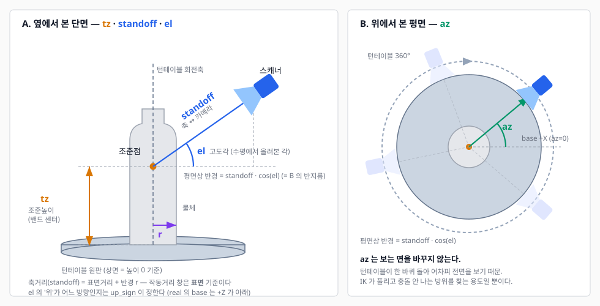
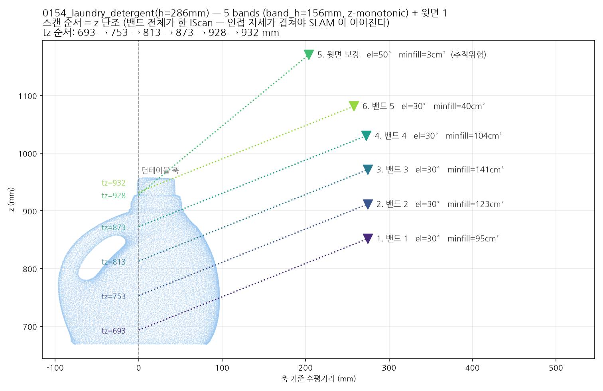

# lookaround — 5면 스캐닝

> 물체를 **높이 방향 띠(밴드)로 썰어**, 밴드마다 로봇을 그 높이의 자세로 옮기고
> 턴테이블을 한 바퀴 돌린다. 밴드 전체가 **끊기지 않는 한 번의 스캔(IScan)** 이라
> 로봇이 밴드 사이를 이동하는 동안에도 SLAM 이 붙어 있어야 한다 — 그래서 밴드는
> z 단조 순서로, 서로 겹치게 돈다.
>
> 그렇게 윗면과 옆면을 합쳐 5면을 얻는다. 바닥면은 원판에 닿아 있어 flip(뒤집기)의
> 몫이다.
>
> **밴드가 1개로 끝나는 경우도 있다** — 한 자세가 물체 높이를 충분히 덮으면(납작하거나
> 작은 물체) 그게 옛날의 "한 자세 고정" 동작이다. 지금은 그쪽이 특수한 경우다.
>
> 앞 단계 `2_preview.md`(형상 탐색) · 부족면 보강 `4_nbv.md`
>
> **§0(결정 요약)·§1(실행)이면 쓰기에 충분하다.** §2 이후는 왜 그렇게 도는지다.
> 문제가 생기면 맨 뒤 부록(T1~T11)을 본다.
>
> **검증 상태 (2026-09-22)** — sim 에서 testset 9종 계획·스캔 확인. 실물(머스타드)은
> 2026-09-21~22 에 run 8회: **밴드 1 은 한 바퀴 붙는다**(fail=0, regErr≈+0.25). **밴드
> 이음매(로봇 이동)에서는 아직 잃는다**(§7) — 되돌아가기와 새 IScan 이어붙이기가 그 대응이고,
> 다음 run 의 `band_move`/`band_continue` 이벤트로 확인한다. `ignore_registration_errors`
> 는 **True 여야 한다**(§7, T10) — False 로 바꾸면 밴드 1 시작 1초 만에 잃는다.

---

## 0. 결정 요약

이 단계가 내리는 판단 전부다. **순서대로 읽으면 한 번의 lookaround 가 그대로 나온다.**

### 목적함수 — 자세 하나를 얼마나 좋다고 보나

후보(고도각 × standoff × 조준높이)마다 턴테이블 한 바퀴를 36등분해 미리 돌려보고,
**점수가 가장 높은 하나**를 고른다.

```
score = 2.0 · min(min_fill / 12cm², 1)   ← 최악 프레임 가시면적  (지배항)
      + 1.0 · z_cover_frac                ← 높이 방향 커버율
      + 0.5 · covered_frac                ← 품질 기준으로 본 점 비율

min_fill = min over θ ( 그 순간 보이는 면적 )      ← 평균이 아니라 **최솟값**
```

**최솟값을 쓰는 것이 핵심**이다(maximin). Artec 은 직전 프레임에 정합하므로 한 프레임만
놓치면 그 뒤가 전부 날아간다 — "평균적으로 잘 보인다"는 의미가 없다.

### 판정 — 무엇을 보고 정하나

| 무엇을 정하나 | 판정식 / 기준 | 임계 | 코드 |
|---|---|---|---|
| **단일 자세로 끝낼까** | **둘 다** 넘어야 단일. 하나만 보면 절반만 스캔한다(§5) | `z_cover ≥ 0.75` **AND** `zspan/h ≥ 0.90` | `ZCOVER_MIN` / `ZSPAN_MIN_FRAC` |
| **밴드 몇 개로 시작** | 센터 간격이 겹침을 보장하게: `m = 1 + ⌈센터span / (band_h·(1−ov))⌉`. `band_h` 는 그 자세가 **실제로 덮은** 연속 z 폭 | `ov = 0.40` | `BAND_OVERLAP` |
| **밴드를 더 쪼갤까** | 공칭이 아니라 **측정한** 인접 겹침. 곡률·가림 때문에 실제는 늘 더 작다 | 최소 겹침 < 25% → +1 (최대 +3) | `BAND_ADJ_OVERLAP_MIN` / `BAND_MAX_EXTRA` |
| **밴드를 되돌릴까** | 쪼개서 **더 덮은 점 비율**. z-span 미달의 원인이 높이가 아니라 윗면이면 쪼개도 소용없다 | 이득 < 3.5%p → 단일로 복귀 | `BAND_GAIN_MIN_COV` |
| **윗면 보강을 넣을까** | 윗면 점의 커버율이 낮고, 높은 el 자세가 그보다 낫다 | 커버 < 50% · el ≥ 50° | `CAP_COVER_MIN` / `CAP_EL_MIN_DEG` |
| **캡처 순서** | **z 단조** 한 방향. 방향만 안전한 끝(min_fill 큰 쪽)에서 시작 | — | `_band_capture_order` |
| **이 자세를 실행할까** | `min_fill` 이 배제선 아래면 볼 면이 없어 tracking lost 가 난다 | ≤ 1cm² 제외 · < 6cm² 경고만 | `FILL_HARD_MIN_CM2` / `FILL_MIN_CM2` |
| **방위각(az)** | **최적화하지 않는다.** az 는 관측을 안 바꾸므로(회전은 턴테이블 몫) 후보를 순서대로 훑어 **IK + 충돌을 처음 통과하는 것**을 쓴다 | 후보 `0°, +30°, −30°` | `solve_plan_poses` |
| **캡처 중 거리 보정** | 밴드 핵심 높이대의 표면거리 중앙값이 창 중앙에서 불감대 밖이면 **축거리만** 옮긴다. el·az·tz 는 안 건드린다. lost 판정 전까지만 프레임을 믿고, 이동에 측정이 안 따라오면 그 밴드의 추종은 끊는다(§2) | 불감대 창폭/6 · 1회 ≤ 25mm · 밴드 시작 ≤3회 + 회전 중 OK 프레임 8개마다 | `standoff.StandoffTracker` / `_track_standoff` |

### 두 가지만 기억하면 된다

1. **공칭은 시작점, 측정이 판정이다.** 밴드 수는 기하식으로 시작하되 **실제로 겹치는지
   재서** 늘린다. 밴드가 이득이 있는지도 재서 되돌린다.
2. **로봇이 고르는 자유도는 고도각 하나**다. 방위는 턴테이블이 담당하므로 점수에
   들어가지 않고, 축거리는 작동거리 창이 정한다.

---

## 1. 실행

### sim

```bash
cd ~/workspace/sync/2_Rapid_Digital_Twin/1_MMS/MMS
env -u PYTHONPATH MMS_BACKEND=isaac MMS_SIM_STAGE_UNTIL=lookaround \
    ~/miniconda3/envs/env_isaacsim/bin/python -u main_artec.py --no-prompt
```

### real

```bash
env -u PYTHONPATH MMS_BACKEND=real \
    ~/miniconda3/envs/mms-env/bin/python -u main_artec.py --until lookaround
```

`--until` 은 `preview | lookaround | nbv | flip` 이고 **앞 단계는 항상 포함**이다.

| 플래그 | 뜻 |
|---|---|
| `--no-recovery` | lost 자동복구를 끈다 — 원래 스캔이 붙는지만 볼 때 |
| `--no-planner` | 자세 플래너를 끈다(preview·계획 생략, home 고정). 캡처 루프만 떼어 볼 때 |
| `--no-prompt` / `--no-viewer` | pass 사이 Enter 생략 / 라이브 뷰어 스냅샷 끔 |
| `--max-passes 1` | 한 자세만 돌고 끝 |
| `--speed-scale K` | 로봇 속도 배율(계획용·nbv·복구 세 곳 한 번에) |
| `--no-sproj` / `--texturize` | raw·최종 sproj 저장 끔(각 ~47s) / SDK 텍스처링(CPU 15~20분, 기본 끔 → Studio, `6_postprocess.md` §5) |

**run 뒤에 볼 것** — 콘솔 로그(`output/<RUN_TS>/run.log`) 말고도 세 가지가 남는다:

```bash
python scripts/artec/lost_report.py          # output/<RUN_TS>/events.jsonl 집계 — 언제 잃었고 뭘 했나 (§7)
output/<RUN_TS>/                             # ★ run 산출물은 전부 이 폴더 (규칙: utils/run_paths.py, README.txt 자동 생성)
output/<RUN_TS>/scan_dumps/scanNN_<stage>_poseK.npz   # IScan 별 원본 점군 (오프라인 정합, 6_postprocess.md)
output/<RUN_TS>/aligned/aligned.sproj                 # 변환 적용·SDK 정합 전 IScan — Artec Studio 로 여는 파일
output/<RUN_TS>/debug/preview/p{NNN}_tz{}_d{}_az{}.png      # preview 탐침마다 — '빈 시야' 판정이 맞나 (`2_preview.md`)
output/<RUN_TS>/debug/lookaround/s{NN}_band{b}_start{k}.png  # 거리추종 판정마다: 3D 점을 각도좌표로 펼친 거리 이미지(+텍스처)
output/<RUN_TS>/debug/lookaround/s{NN}_band{b}_live_f{n}.png # 회전 중 live 판정마다 — '정말 멀어졌나' 를 눈으로 본다 (§2)
output/<RUN_TS>/debug/nbv/nbv{NN}_step{KK}_th{DDD}.png       # nbv 정지-촬영 프레임마다 (`4_nbv.md`)
output/<RUN_TS>/debug/flip/s{NN}_band{b}_*.png               # flip 밴드 캡처 (lookaround 와 같은 형식)
output/<RUN_TS>/debug/cam/<단계>/                            # 카메라 스냅샷 (utils/debug_view.py)
```

**네 단계 모두 같은 형식**이다 — 3D 점을 광축 기준 각도좌표로 펼치고 카메라까지의 거리로
색칠한 그림에, 그 순간 텍스처 프레임을 옆에 붙인다. 뷰어는 그 run 의 단계 폴더를 전부
시간순으로 이어 보여주므로 preview → lookaround → nbv → flip 이 한 흐름으로 지나간다.

`s{NN}` 은 IScan(세션) 번호다 — 밴드 이어붙이기로 IScan 이 여러 개면 파일이 덮이지 않게
붙는다. 이 이미지들은 **run 중에 창으로도 뜬다**(`main_artec.py` 가 자동 실행):

```bash
python scripts/artec/live_range_view.py --run <RUN_TS>   # 수동으로 띄울 때
```

`SPACE` 로 멈추고 `←`/`→` 로 앞뒤 장을 넘기면 **이동 전/후 두 장을 나란히 비교**할 수 있다
(거리추종이 "이동했는데 측정이 안 따라옴" 으로 꺼졌을 때 그게 맞는 판정인지 보는 용도).
`q` 로 닫는다. 끄려면 `main_artec.py --no-range-view`. 점군 뷰어(`live_scan_view.py`)와
달리 자식 프로세스로 띄워도 되는 이유는 Filament 가 아니라 OpenCV 창이기 때문이다.

> ⚠ **창은 run 마다 하나씩 생기고 스스로 닫히지 않는다.** 끝난 run 의 창은 그 run 의
> 마지막 장에서 멈춰 있는데, 이걸 이번 run 의 창으로 착각해 "뷰어가 멈췄다" 로 보기 쉽다
> (2026-09-22 실제로 그랬다). 그래서 **창 제목에 RUN_TS 가 들어가고**, 새 이미지가 45초
> 넘게 없으면 배너가 `LIVE` → `FINISHED (no new img Nm)` 로 바뀐다. 쌓이는 게 싫으면
> `live_range_view.py --idle-exit 300` 처럼 스스로 닫게 한다.

**동영상으로 남기려면** (기본 꺼짐):

```bash
python main_artec.py --range-video                          # run 과 함께 녹화 → output/<RUN>/debug/range.avi
python scripts/artec/live_range_view.py --run <RUN> --make-video   # 끝난 뒤 PNG 로 만들기 → .mp4
```

PNG 가 원본이라 **사후 제작(`--make-video`)이 언제나 가능하고 더 안전하다**. 라이브 녹화는
창을 닫지 않고 강제 종료될 수 있어서 컨테이너를 AVI/MJPG 로 쓴다 — mp4 는 그때 moov atom 이
안 쓰여 통째로 재생 불가가 되지만(실측 44바이트), AVI 는 잘려도 쓴 프레임이 그대로 읽힌다
(강제 kill 실측 13/14).


### 손잡이

밴드·캡처에 관한 것만이다. 거리·실루엣 쪽 손잡이는 **`2_preview.md` §5**.

| 환경변수 | 뜻 | 기본 |
|---|---|---|
| `MMS_SIM_STAGE_UNTIL` | `preview`/`lookaround`/`nbv`/`flip` (sim 전용) | `nbv` |
| `MMS_BAND_OVERLAP` | 인접 밴드 겹침 — **밴드 밀도의 유일한 손잡이**(§5) | 0.40 |
| `MMS_STANDOFF_TRACK` | 밴드 캡처 중 거리추종 `off`/`band`/`live` (§2). `live` 는 OK 프레임 8개마다 축거리를 창 중앙으로 보정(sim `_scan_pass`·real 스트리밍 밴드 루프 양쪽 배선, 2026-09-18). 측정은 **밴드 핵심 높이대**(조준 ±40mm / 광축 세로 ±9.5°)의 점만 — 전체 중앙값은 윗부분에 끌려 물러난다. 비원통 물체에서 점·커버가 는다(세제 모사: 밴드당 +4~57%). 대가는 보정 순간 연속 프레임 겹침 46~62% → 실물 SLAM 확인 항목 | `live` |
| `MMS_SIM_P1_ELS` | 채점할 고도각 후보(°) | `30,40,50,60,70` |
| `MMS_SIM_NTHETA` | 한 바퀴 캡처 프레임 수 (실물 240 = 30s × 8fps) | 240 |
| `MMS_ISAAC_HEADLESS` | 1이면 GUI 없이 (결과 창도 안 뜬다) | 0 |
| `MMS_SIM_USD` / `_OBJECT_PRIM` | 씬·대상물 prim (→ `sim_scene.md`) | v2_real 씬 |

---

## 2. 구현 컨셉

**"한 자세가 실제로 덮은 높이"를 재고, 그만큼씩 겹치게 물체를 가로로 썬다.**

### 자유도를 누가 갖는가

턴테이블이 도니까 **방위는 로봇이 고를 일이 아니다.** 로봇에게 남는 관측 자유도는
**고도각 `el` 하나**고, 거기에 조준높이 `tz` 와 축거리 `standoff` 가 붙는다.



네 값 모두 **턴테이블 축**을 기준으로 잡는다 — 물체 중심이 아니다. 물체가 축에서
벗어나 놓여도 회전하는 내내 시야·작동거리가 유지되게 하려는 것이다.

| 축 | 누가 정하나 |
|---|---|
| `tz` | **밴드가 정한다.** 밴드 센터가 곧 조준높이. 캡처는 **z 단조** 순(§5) |
| `el` | **밴드마다 다시 고른다** — 그 밴드 안의 점으로 maximin 재채점(§4) |
| `standoff` | `el` 과 같이 고르고, 캡처 직전에 **실측으로 다시 잡는다**(아래) |
| `az` | **관측과 무관** — 도달성·충돌만 보고 고른다 |

> **`az` 를 헷갈리지 말 것.** az 를 바꿔도 **보는 면은 안 바뀐다** — 턴테이블이 한 바퀴
> 도니 같은 `el`·`tz` 면 결과가 같다. az 스윕은 "IK 가 풀리고 충돌 안 나는 방위를 찾는"
> 용도다(`solve_plan_poses`). 이걸 관측 자유도로 착각해 az 만 바꿔 전회전을 반복하던
> 버그가 nbv 에 있었다(`4_nbv.md`).

### 밴드 결정 — ②는 시작점, ④가 판정

```
① 단일 자세로 되나?
   후보(el × standoff × tz)를 전회전 maximin 으로 채점 → 최선 1개
   그 자세가 실제로 덮은 연속 z 구간 = seen_span
   seen_span/높이 ≥ 90%  그리고  z_cover ≥ 75%   →  단일로 끝

② 안 되면 — 몇 개로 썰까 (시작점)
   band_h   = seen_span                     ← 실측 그대로. 안전계수 안 곱한다
   step_max = band_h × (1 − BAND_OVERLAP)   ← 센터 간격 상한
   m_min    = 1 + ceil(센터span / step_max)

③ 각 밴드를 다시 푼다
   센터 m 개를 linspace → 밴드마다 el·standoff 재채점
   윗면(뚜껑) 보강 자세를 넣고, 캡처 순서를 z 단조로 정렬

④ 겹침을 **재서** 모자라면 늘린다               ← 진짜 판정
   인접 자세의 seen 교집합 < BAND_ADJ_OVERLAP_MIN(25%) → 밴드 +1 하고 ③ (최대 +3)

⑤ 이득이 없으면 되돌린다
   밴드 합집합 커버 − 단일+윗면 커버 < 3.5%p  →  단일 자세로 복귀
```

**공칭 기하 겹침은 "창이 얼마나 포개지나"지 "같은 면을 보나"가 아니다.** 곡률·입사각·
가림 때문에 실제 겹침은 늘 더 작게 나온다(실측: 공칭 38% → 측정 20%). 그래서 ②는
시작점일 뿐이고 ④가 실제 판정이다.

### 거리추종 — el 은 고정, 축거리만 창 중앙으로

계획이 정한 standoff 는 **preview 가 추정한 반경**에서 나온다. 그 추정은 대개 작고,
회전하면 반경이 θ 에 따라 변하며, 밴드마다 tz 가 달라 그 높이의 반경도 다르다. 그대로
두면 표면거리가 작동거리 창을 벗어난 채 한 바퀴를 다 돈다 — 실물에서 "가끔 물체와
거리가 멀다" 로 보이던 증상이다.

그래서 **표면거리를 재서 축거리만 고친다** — 밴드 시작(턴테이블 정지 중)에 최대 3회
나눠 수렴시키고(`StandoffTracker.converge`), 회전 중에도 **OK 프레임 8개마다** 한 번씩
본다(`MMS_STANDOFF_TRACK=live` 기본, real 은 `_track_standoff`, sim 은 `_scan_pass`).

```
표면거리 중앙값 p  →  국소 반경 r ≈ d − p  →  d_next = 창중앙 c + r = d + (c − p)
```

측정은 **밴드 핵심 높이대**(조준 ±40mm / 광축 세로 ±9.5°)의 점만 쓴다 — 전체 중앙값은
윗부분에 끌려 물러난다. `el`·`az`·`tz` 는 건드리지 않는다 — el 을 바꾸면 그 밴드가 덮는
z 대역이 바뀌어 계획 전체가 흔들리지만, 축거리는 카메라를 시선 방향으로 밀고 당길
뿐이다. 1회 이동은 25mm 로 제한한다(급하게 뛰면 프레임 중첩이 깨진다). 판단은
`utils/nbv/standoff.py::StandoffTracker` 한 곳, sim·real 공용.

실물에서 두 번 데었고(2026-09-21~22) 그래서 가드가 셋이다:

- **프레임을 믿는 조건은 "아직 lost 가 아니다"** (`_track_usable`: `tracking_lost` 아님 ·
  연속 reg<0 가 임계 5 미만). "마지막 프레임까지 정합됨"(`_reg_ok`)을 조건으로 걸었더니
  SDK 워밍업(초기 reg=−1/0) 때문에 **스캔 시작부터 꺼져** 밴드 내내 축거리가 고정됐다
  (run_152915: "추적 끊김 상태" 30회, d=316mm 유지 — "거리 고정" 증상). 지금은 일시
  veto 이고 회복되면 재개한다. 표면거리는 카메라-로컬 정점이라 정합과 무관하다.
- **이동-측정 일관성.** 카메라를 15mm 이상 옮겼는데 측정이 그 60% 도 안 따라오면 그
  밴드의 추종을 끊는다(`standoff_skip` 이벤트). lost 상태의 stale 프레임이 221→219→219mm
  로 읽혀 축거리를 312→387mm 로 밀어낸 사고(run_150720, "스캐너가 너무 멀다")의 대응이다.
- **측정이 없으면 움직이지 않는다.** 예전 `converge` 는 "반환 없음 → 가까이 한 스텝"
  이라 빈 측정에도 헛이동과 `재겨냥 실패` 로그를 냈다.
- **희소 프레임은 측정이 아니다** (`TRACK_MIN_PTS` 300, `MMS_STANDOFF_MIN_PTS`). run_161342
  의 디버그 이미지: 밴드 시작·live 판정이 **4·17·28·34 점**짜리 프레임의 중앙값으로 25mm 씩
  움직였고(물러남 → 더 희소 → 또 물러남, 밴드 2 가 축거리 380mm 까지), "이동에 측정이 안
  따라옴" 판정도 4점 프레임이 내렸다. 정상 프레임은 수천 점이다.
- **스캐너 프레임 광축은 −z 다.** 핵심 높이대 마스크가 `max(z, 0)` 을 써서 실물에서는
  **항상 비었고**(이미지 `core=0`), 거리추종은 설계와 달리 프레임 전체 중앙값으로 돌고
  있었다. 2026-09-22 dump 로 확인(정점 z<0 100%)하고 |z| 로 고쳤다.

실측(sim, 오차 +70mm 주입): 5밴드 전부 250mm 부근(251~260mm)으로 수렴. 실물 확인 항목:
밴드 1 시작에 `[거리추종] f0 표면 …mm → …` 가 "끊김" 없이 실제로 보정하는지.

> ⚠ **단일 자세 계획도 밴드 경로를 탄다** (2026-09-22). 컨트롤러가 `len(poses) > 1` 일
> 때만 `capture_bands` 를 불러서, 자세가 1개면 `capture_rotation` 으로 갔고 그쪽엔 밴드
> 맥락이 없어 거리추종·되돌아가기·새 IScan 이어붙이기가 **조용히 빠졌다**(run_154059:
> `[거리추종]` 로그 0줄, 축거리 313mm 고정). 지금은 플래너가 실패한 `AT_CURRENT` 만
> 예전 경로다. `[stage] → 밴드 1개를 한 scan 으로 …` 가 찍혀야 정상.

### 대상물은 계획 전에 장애물로 등록된다

셀 CAD 에는 스캔 대상이 없다 — "225mm 까지 접근하는 대상" 이라 일부러 뺐는데, 그 결과
자세 사이 이동 경로가 물체를 관통해도 아무도 안 막았다(2026-09-16 실물: nbv 이동 중
로봇이 대상을 치고 지나감). 지금은 세 겹이다:

1. **preview 전** — 축 둘레에 **원판 반경**(150mm) 보수적 원기둥. 아직 물체를 모르니
   "물체는 원판 위에 서 있으므로 그보다 넓을 수 없다"를 쓴다. **마진은 0** 이다 —
   원기둥 자체가 이미 최대 가정이라 위에 또 얹으면 이중보정이고, 실효 keepout 이
   커지면 preview 의 **가까운 쪽 탐침 칸을 잡아먹는다**(`PREVIEW_RADIUS_MAX_M` 180mm +
   마진 30mm 를 쓰면 keepout 210mm → el 30° 에서 축거리 242mm 아래로 못 간다).
   그래서 `guard_blocks_probe` 가 시작할 때 막히는 구간을 계산해 경고를 찍는다 —
   **그 구간 탐침은 로봇이 가지도 않고 "빈 캡처"로 보이기 때문**이다.
2. **preview 후** — 실루엣 점군
3. **nbv 메시 후** — 실측 메시 정점 (더 정확)

2·3 은 **축 둘레로 쓸어 회전체**로 등록한다(`swept_about_axis`). 점군은 θ=0 canonical
인데 로봇이 움직이는 시점의 턴테이블 각은 0 이 아니라서, 비대칭 물체면 장애물이 실제와
다른 방향을 향하기 때문이다. 등록은 `solve_plan_poses` 의 충돌 게이트보다 **앞**이라
밴드 자세 선정부터 반영된다.

### sim 과 real

**판단 로직은 같은 코드다.** `collect_planning_points` → `plan_lookaround_viewpoints` →
`solve_plan_poses` 를 두 백엔드가 그대로 부르고, 주입하는 것은 콜백 세 개(preview 캡처 /
자세 IK / 충돌 게이트)뿐이다. **작업 프레임도 2026-09-17 부터 둘 다 base 다** — 예전엔
sim 만 world 라 `up_sign=+1` 경로만 돌았고, real 전용 분기(천장 마운트라 +Z 가 아래)가
sim 에서 한 번도 검증되지 않았다. 그게 "sim 에서는 되는데 real 에서만 안 되는" 의
구조적 원인이었다. sim 은 USD 를 읽고 씬에 그릴 때만 world 로 나간다.

다른 것은 **스캔 쪽**이다 — real 은 Artec SDK 의 streaming SLAM 으로 프레임을 정합하고
추적 상실 감시·복구가 붙는다(§7). sim 은 GT θ 로 누적한다(§8). 즉 **자세를 어디로 보낼지는
sim 이 담보하지만, 그 자세에서 스캔이 붙어 있느냐는 실물에서만 확인된다.**

---

## 3. 왜 이렇게 도는가

Artec Spider 는 프레임 좌표를 **직전 프레임에 정합해서** 얻는다(streaming SLAM). 기준이
상대적이라 한 프레임을 놓치면 그 뒤를 이어붙일 근거가 사라진다 — **추적을 잃는 순간
그때까지 쌓인 것만 남는다.**

그래서 성패를 가르는 것은 hand-eye 나 θ 의 정확도가 아니라 **프레임 간 겹침**이다.
각도를 띄엄띄엄 옮기면 겹침이 끊기므로 턴테이블을 **천천히 연속 회전시키면서 최대 FPS
로** 찍는다. 회전을 멈추고 자세를 옮기는 방식은 **이 단계에서는** 쓰지 않는다(nbv 의
정지-촬영은 IScan 을 따로 만들므로 다르다 — `4_nbv.md`).

이 성질에서 나머지가 따라온다. 방위각은 턴테이블이 다 커버하므로 로봇이 고를 자유도는
**고도각 φ 하나**(§4)고, 한 자세로 높이를 못 덮으면 z 방향 밴드로 나눈다(§5). 그리고
추적을 감시할 watchdog 과 끊겼을 때 되돌아갈 지점이 반드시 필요하다(§7).

---

## 4. 자세 선정 — 전회전 maximin 채점

`utils/nbv/lookaround.py::plan_lookaround_viewpoints` (sim·real 공용).

**한 밴드 안에서는** 물체가 도는 동안 로봇이 그 자리에 머문다. 그래서 자세를 고르는
일은 **그 밴드의 360° 전체를 자세 하나로 감당할 수 있는가**를 묻는 일이다. 후보마다
θ 를 36등분해 한 바퀴를 미리 시뮬레이션하고 **평균이 아니라 최악 프레임으로** 점수를
매긴다(maximin). 납작한 물체가 edge-on 으로
지나가는 한순간에 끊기면 그 뒤가 전부 날아가기 때문이다.

```
score = 2.0 · min(min_fill / 12cm², 1)   ← 최악 프레임 가시면적 (지배항)
      + 1.0 · z_cover_frac                ← 높이 방향 커버율
      + 0.5 · covered_frac                ← 품질-가시 비율
```

탐색 격자는 고도각(`DEFAULT_ELS = 30/40/50/60/70°`) × standoff 3종
(`near+20mm+r_max`, `mid+r_max`, `mid+r_max+30mm`) × 타깃높이 3종(z 의 35/50/65 분위수)다.
`el=20°` 는 도달 자세가 없어 2026-09-17 에 기본값에서 뺐다 — 두 백엔드가 이미 안 쓰고
있었는데 기본값만 남아서 **검증 스크립트가 실제로 안 쓰는 el 로 검증**하고 있었다.
**방위각은 점수에 안 들어간다** — 회전 대칭이라 관측 조건을 못 바꾸고 도달성과 충돌만
좌우하므로, 백엔드가 스윕해 통과하는 값을 고른다(T4).

가시성 판정(`SensorModel`)은 frustum ∩ 작동거리 창 ∩ 입사각이다. **작동거리 창은
스캐너에게 물어본다**(`scanning_range()`, 양쪽 백엔드 공통 계약) — `(0.20, 0.30)m` 는
조회가 실패했을 때의 기본 가정일 뿐이다. 이 창은 밴드 수와 standoff 를 동시에 좌우하므로
`2_preview.md` §3 과 같은 값을 본다. 그리고 **입사각 한계가 둘**인 것이 요점이다. 누적·품질에는 50°까지만 쳐주고 추적 기여는 75°까지
인정한다 — 비스듬히 스치는 면은 모델엔 보탬이 안 돼도 추적은 붙잡아 준다.

물체 점은 클러스터링 없이 **캘리브 기하로 자른다**(`crop_object_points`: 원판 위 +
축 실린더 안). "턴테이블을 물체로 착각해 조준하는" 실패가 구조적으로 불가능해진다.

**점군은 GT 없이 실제 캡처로 모은다** — 그 단계가 preview 이고 내용은 **`2_preview.md`**
에 있다. 여기서 알아야 할 것은 하나다: **이 점군이 아래 밴드 산정의 입력 전부**라,
반경을 작게 잡으면 standoff 가 어긋나고 높이를 놓치면 밴드 수가 통째로 틀린다.

캡처한 점은 로봇 자기 점을 먼저 지운다(`filter_robot_points`) — 링크가 프레임에 걸리면
크롭 실린더를 오염시켜 밴드 수가 폭주한다(2026-07-08 세제 13밴드).

최악 프레임이 `FILL_MIN_CM2 = 6cm²` 미만이면 계획은 그대로 두되 `tracking_risk` 로 표시만
한다. 복구 전용 채점기는 이것과 **다른 것**이다(§7).

---


## 4b. 옆면 커버리지 — 낮은 고도각과 채점 (2026-09-23)

**문제**: el 후보가 30° 이상뿐이면 전부 '내려다보는' 자세라 눕힌 물체의 **옆면**(법선이 수평)이
구조적으로 안 찍힌다. run_125718 실측 — 옆면 법선 점이 lookaround 26%·flip 21%, 방위 12구간 중
5~6구간이 300점 미만, 디스크 위 0~40mm 는 전체의 5%. 그 상태로는 두 패스가 공유할 면이 없어
**flip 정합이 성립하지 않는다**(후처리 문제가 아니라 취득 문제).

같은 preview 로 el 별 단일자세를 재면:

| el | 전체 커버 | **옆면 커버** | minfill |
|---|---|---|---|
| 15° | 32.5% | **64.7%** | 15.1cm² |
| 20° | 32.1% | 59.7% | 17.8cm² |
| 30° | 32.5% | 46.7% | 19.1cm² |
| 50° | 22.7% | 10.1% | 26.2cm² |
| 70° | 17.3% | 1.0% | 29.8cm² |

전체 커버는 15~30° 가 **같고** minfill 도 둘 다 기준 위라 점수가 **정확히 동점**이었다 —
그래서 채점기가 추적 여유가 큰 30° 를 골랐다. 세 가지를 바꿨다:

1. `DEFAULT_ELS`·`lookaround_els_deg` 에 **20·25°** 추가. 도달 못 하는 el 은
   `solve_plan_poses` 의 IK·충돌 검사가 걸러 내고 `✘ … 도달 자세 없음` 으로 로그에 남는다
   (옛 주석은 "20° 는 도달 자세가 없다" 였다 — 후보로만 두고 실측으로 판단한다).
2. 자세 채점 `_score` 에 **옆면 커버 항**(`SIDE_SCORE_W=0.5`, 전체 커버 항과 같은 크기).
   검증: 같은 preview 에서 선택이 el 30°(옆면 46.7%) → **el 20°(59.7%)** 로 바뀐다.
3. 밴드 vs 단일 판정에 **옆면 조건**. 면적 이득이 `BAND_GAIN_MIN_COV`(3.5%p) 미달이어도
   옆면 커버가 `SIDE_COV_MIN`(75%) 미만이고 밴드가 `SIDE_GAIN_MIN`(4%p) 이상 더 덮으면
   밴드를 유지한다. 검증: 이득 부족을 강제했을 때 옛 동작은 단일+윗면(옆면 55.4%),
   새 동작은 3밴드+윗면(옆면 **80.3%**).

로그에 `[lookaround] 옆면(법선 수평±30°) 커버 — 밴드 …% vs 단일+윗면 …%` 가 항상 찍힌다.
⚠ 낮은 el 의 **실물 도달성은 미검증**이다 — 다음 run 에서 el 20·25° 가 채택되는지,
`도달 자세 없음` 이 뜨는지 확인할 것.

## 5. 밴드 분할

한 자세로 높이를 다 못 덮으면 z 방향으로 겹치는 밴드를 나눠 여러 번 돈다.



> 그림은 **계획기를 실제로 돌려서** 그린다 — 코드가 바뀌면 다시 뽑을 것:
> ```bash
> env -u PYTHONPATH $MMS_PYTHON scripts/sim/plot_band_plan.py --obj laundry_detergent
> ```
> (2026-09-18 이전 그림은 생성기가 없어 조용히 낡아 있었다: 모든 밴드가 `el=20°`,
>  순서가 safe-first, 4밴드 — 셋 다 지금은 사실이 아니다.)
>
> 읽는 법 — 번호는 **캡처 순서**, `tz` 는 조준높이, 삼각형은 카메라 위치다. 세제는
> 밴드 5개가 z 단조로 올라가고 마지막에 뚜껑 보강 자세가 붙는다. 뚜껑 자세만 `el=50°`
> 인 것은 수평 윗면이 낮은 el 에서 입사각 한계에 걸려 안 보이기 때문이고(§5),
> `minfill=3cm²` 로 추적위험 표시가 붙는 것은 뚜껑만 보는 자세라 보이는 면적이 작아서다
> — 배제선(1cm²)은 넘으므로 실행은 된다(§4).

**기준은 물체 높이가 아니라 §4 에서 고른 자세가 실제로 덮은 양**이고, 조건이 **둘 다**
충족돼야 단일 자세로 끝낸다:

```
z_cover  ≥ ZCOVER_MIN     0.75     ← 닿은 z-bin 의 비율
zspan/h  ≥ ZSPAN_MIN_FRAC 0.90     ← 실제로 덮은 **연속** z 구간 / 물체 높이
```

둘째 조건이 없으면 위아래만 조금씩 걸치고 가운데가 빈 자세가 통과한다. 실제로
`0101_spray_can` 이 그 경우다 — `z_cover=0.75` 로 첫 조건은 **딱 통과**하는데
`zspan=153mm/202mm=0.76` 이라 둘째에서 걸려 밴드로 간다. 첫 조건만 보면 이 물체를
자세 하나로 끝내고 절반만 스캔한다(2026-09-16 실측 증상).

판정은 `[lookaround] z_cover=… zspan=…` 한 줄에 둘 다 찍힌다.

밴드 수를 정하는 것은 **`band_h`(= 그 자세가 덮은 연속 z 구간)와 물체 높이의 비**다.
`band_h` 는 standoff 에 비례하고 standoff 는 물체 반경에 비례하므로, **가는 물체일수록
카메라가 가까워 한 자세가 덮는 높이가 줄어든다.** 다만 실측에서 그 효과는 크지 않고
(아래 셋의 `band_h` 는 145~156mm 로 비슷하다) **밴드 수는 사실상 높이가 가른다**:

| 물체 | 높이 | 지름 | standoff | `band_h` | 결과 |
|---|---|---|---|---|---|
| `0154_laundry_detergent` | 286mm | 194mm | 317mm | 156mm | 5밴드 + 윗면 1 |
| `0101_spray_can` | 202mm | 69mm | 285mm | 153mm | 4밴드 |
| `0001_mustard` | 186mm | 98mm | 299mm | 145mm | 4밴드 |

(testset GT 점군, 2026-09-18 현재 코드. 실제 스캔은 preview 추정 반경을 쓰므로
standoff 가 조금 달라질 수 있다.)

밴드 높이 `band_h` 는 자세가 실제로 덮은 **연속 z 구간 그대로**다 — 안전계수를 곱하지
않는다. 겹침은 `BAND_OVERLAP`(기본 0.40) 한 곳에서만 흡수한다. 밴드 수는
`m = 1 + ceil(센터span / (band_h·(1−overlap)))` — **ceil** 이어야 실제 센터 간격이
의도를 넘지 않아 겹침이 기준 아래로 안 떨어진다.

> **0.40 으로 내렸다 (2026-09-18).** 이전 기본 0.61 은 측정값이 아니라 두 안전계수를 곱한
> 합병값이었다(`BAND_H_SAFETY 0.60` × `(1−0.35)`). 요구 겹침(`BAND_ADJ_OVERLAP_MIN`)은
> 25% 인데 공칭이 그 2.5배라 ④의 되먹임(모자라면 밴드 +1)이 발동할 일이 없었다.
>
> 근거 — 지금 플래너(밴드별 축거리·4방향 preview)로 세제 preview 점군을 오프라인 재현:
>
> | overlap | 밴드 | 전회전 | 측정 인접겹침 최소 | 품질 커버 |
> |---|---|---|---|---|
> | 0.61 | 5 | 6 | 55% | 93.6% |
> | **0.40** | 4 | **4** | 51% | 91.9% |
> | 0.30 | 3 | 3 | 41% | 90.9% |
>
> 전회전 6→4(실물 약 −1분/물체)에 커버 −1.7%p. 2026-09-17 의 "0.35 에서 세제가 단일 자세로
> 무너짐(44,360점)" 은 **옛 플래너**(전체 r_max 축거리·2방향 preview) 결과라 지금과 다르다.
> 스프레이·머스타드·알람시계 는 preview 덤프가 지워져 재확인 못 했다 —
> `bash scripts/sim/preview_testset.sh --headless` 로 덤프를 다시 만들면 같은 표를 4종으로 낼 수 있다.

### 윗면 보강 자세가 조용히 빠지던 버그 (2026-09-22)

`_augment_top_face` 는 "상단 30mm 안에서 법선이 위를 향하는 점이 **50개 미만**이면 윗면이
없는 물체(구·원뿔)" 로 보고 보강 자세를 안 넣었다. run_184746 은 그 점이 **49개**였다 —
한 개 차이로 밴드 3개가 전부 `el=30°` 가 됐고, 뚜껑(라벨면)에 구멍이 남았다. 같은 상단부
131점의 법선은 p50 +0.81 · max +1.00 으로 **분명히 윗면이 있었다.**

두 가지를 고쳤다.

- **문턱을 점군 밀도에 비례**시켰다(`max(15, 0.2% of N)`). 절대 50 은 preview 7천점 기준으로
  임의값이었다. 진짜로 평평한 윗면이 없는 물체는 이 문턱이 아니라 **커버율 판정**이 거른다.
- **입사각을 감안해 고른다**(`CAP_SCORE_MARGIN` 0.15). 채점에 쓰는 cap 점은 preview 가
  옆(el=30°)에서 본 **테두리**뿐이고, 정작 채워야 할 윗면 **중앙**은 점이 없어 점수에
  안 들어간다. 그래서 점수가 근소하게 낮아도 가파른 el 을 택한다 — 수평면 입사각은
  90°−el 이라 el=50°→40°, 70°→20° 로 품질 차가 크다.

같은 preview 점군으로 재계획하면 `el30 el30 el30` → `el30 el30 el30 + el70(cap)` 이 된다.
실물에서 el=70 으로 윗면이 잘 찍혔다는 관찰과 일치한다.

> ⚠ 남은 한계 — **preview 는 el=30° 옆에서만 본다**(`preview_el_deg`). 윗면 중앙은 원리적으로
> 안 잡히므로 "윗면 커버율" 은 늘 테두리 기준의 과대평가다. 커버율이 50% 를 넘어 보여 보강
> 자세가 빠지는 경우가 남아 있다. 근본 해결은 preview 탐침에 높은 el 을 한 번 넣는 것이다.

### 물체 높이는 분위수가 아니라 밀도로 (2026-09-23)

preview 점군의 1% 분위수·최댓값으로 잡던 "물체 꼭대기"가 **성긴 잡음 꼬리**에 끌리고
있었다. run_102221: preview p1 = 119mm, 최댓값 129mm 인데 점의 96% 는 85mm 아래에 있고
master 스캔의 밀도 기준 꼭대기도 80~85mm 다(눕혀 놓은 머스타드, 두께 ~80mm). 이 40mm 가
세 군데를 동시에 망가뜨렸다.

- **밴드 계획** — 80mm 물체에 밴드가 109·119mm 까지 잡혀 윗밴드가 허공을 돌았다. "윗밴드는
  늘 빈다"의 원인이 이것이다(물체가 없는 높이였다).
- **flip 되돌리기** — 반사면 H/2 가 20mm 위로 잡혀 flip 의 뒷면이 master 의 라벨면 높이에
  겹쳤다("윗면과 아랫면이 겹쳐 보인다").
- **nbv 윗면 부족분** — 있지도 않은 33mm 가 "부족" 으로 나왔다.

지금은 `robust_top_height` 한 곳에서 잰다: 디스크면부터 5mm 구간 히스토그램을 위에서 내려오며
**처음으로 전체의 2% 이상을 담는 구간의 위 경계**. 플래너는 그 위의 점을 계획 점군에서 아예
빼고(`plan_lookaround_viewpoints`), 윗면 자세(`_augment_top_face`)·flip 피벗(`_flip_pivots_B`)·
nbv 부족분(`_cap_shortfall_m`)이 같은 값을 쓴다. 얇은 돌출부(노즐)는 밴드 계획에서 빠질 수
있는데, 그건 nbv 몫이다.

**넓은 수평 윗면이면 보강 자세를 강제한다**(`CAP_FORCE_FRAC` 5%). 옆 밴드(el≤40°)는 수평면을
입사각 50°+ 로밖에 못 봐 실제 스캔엔 구멍이 남는데, preview 점 기반 커버율은 그걸 못 잰다
(라벨면 점 2,182개가 el=30 에서 "70% 커버" 로 나와 보강이 빠졌다). 위쪽 법선 점이 전체의
5% 를 넘으면 커버율과 무관하게 el 높은 자세를 하나 넣는다.

### 플래너 입사각 여유 — 45° vs 캡처 필터 50° (2026-09-18)

플래너의 "품질-가시" 판정(`SensorModel.max_incidence_deg`)은 캡처 필터(sim
`MAX_INCIDENCE_DEG` 50°)보다 **5° 엄격한 45°** 다. 같은 값이면 모델이 "겨우 덮는다" 고
계산한 면이 실제 캡처에서는 경계에서 통째로 잘린다. 세제 실측: 뚜껑 윗면을 el=40° 밴드가
입사각 50.0° 로 덮었다고 봐서 뚜껑 보강 자세를 빼먹었고, 결과 메시 뚜껑에 Ø52mm 구멍이
남았다(nbv 는 Poisson 이 그 구멍을 닫아 gap 으로 못 봤다). 45° 면 뚜껑 자세가 들어간다.

### 캡처 순서 = z 단조 (2026-09-17)

순서는 **z 오름/내림 한 방향**이다. 방향만 안전한 끝(min_fill 큰 쪽)에서 시작한다.

> ⚠ 예전에는 **safe-first**(min_fill 내림차순)였다. 그건 **밴드 = 독립 IScan** 이던
> 시절의 규칙이다 — 밴드가 끊겨도 각자 정합되니 위험한 밴드를 뒤로 미루는 게 이득이었다.
> 2026-09-16 에 밴드 전체가 **한 IScan** 이 되면서 전제가 사라졌다: 로봇이 다음 밴드로
> 옮겨가는 동안 SLAM 이 이어져야 하고, 그러려면 **캡처 순서상 인접한 두 자세가 같은 면을
> 봐야 한다.**
>
> 실측 2026-09-17 (testset 9종 실제 점군, 인접 자세 seen 겹침 최악값):
>
> | 물체 | safe-first | z 단조 |
> |---|---|---|
> | mustard | **0%** | 64% |
> | spray_can | **0%** | 58% |
> | laundry_detergent | **0%** | 20%* |
> | alarm_clock | 12% | 57% |
>
> \* 뚜껑 보강 자세와의 이음매. 밴드끼리는 60% 이상이다.
>
> 9종 중 4종이 0~12% 였다 — 실물에서 본 "band1/band2 가 정합되지 않음 · 메시 2덩어리"
> 가 이 순서 문제다.

겹침은 **공칭 기하값이 아니라 재서** 확인한다(`BAND_ADJ_OVERLAP_MIN = 0.25`). 곡률·입사각
때문에 실제 겹침은 늘 공칭보다 작다(실측: 공칭 38% → 측정 20%). 미달이면 밴드를 하나씩
늘려 다시 짠다(최대 `BAND_MAX_EXTRA = 3`).

반대로 **밴드가 이득이 없으면 단일 자세로 되돌린다**(`BAND_GAIN_MIN_COV = 0.035`).
z-span 미달의 원인이 높이가 아니라 **윗면**일 수 있는데(납작·넓은 물체), 그건 z 로 쪼개도
해결되지 않고 전회전 횟수만 늘어난다 — `_augment_top_face` 의 몫이다. 이득은 z-span 이
아니라 **덮은 점 비율**로 잰다(실측 alarm_clock: Δz-span 0mm 인데 Δ커버 +4.8%p).

밴드 하나가 실패해도 중단하지 않고 건너뛴다. 도달 못 한 대역은 nbv 가 메운다(T3).

---

## 6. 실물 아키텍처

`mms_artec/nbv/artec_streaming_scan_session.py::ArtecStreamingScanSession.run()` 이
스캐너와 턴테이블을 두 thread 로 물려 돌린다. 둘은 `TrackingState` 하나를 공유하고,
추적을 잃으면 즉시 `stop_event` 로 턴테이블을 세운다.

```
   Main thread                        TurntableController (thread)
   poll_events() ─ SDK 큐 비움         move_velocity 연속 회전
   θ 기록 · 라이브 뷰어 공급           getActualPos polling 10Hz
   watchdog 4종 검사                   stop_event → 즉시 정지
   last-good θ 갱신                    drive 통신사망 watchdog
            └────── TrackingState (공유) ──────┘
```

시작 시 턴테이블 logical 0 을 reset 하고, preview 를 띄워 settle·drain 한 뒤(preview
프레임이 통계에 섞이면 안 되므로 카운터를 0 으로) `start_record` 와 동시에 회전을 건다.
매 tick 마다 `poll_events()` 를 부르는데 **이걸 거르면 SDK 가 얼어붙는다.**

결과 `ArtecStreamingScanResult` 는 `model`, `n_frames`, `rotation_actual_deg`,
`fps_actual`, `tracking_lost`, `loss_reason`, 복구 기준 **`last_good_theta_rad`**(= `reg_err
≥ 0` 인 마지막 θ), 밴드 진행 **`n_bands` / `n_bands_done` / `band_reasons`**, 그리고 lost
로 끝났을 때 잘라낼 꼬리 **`n_tail_lost`** 를 담는다. 오케스트레이터
(`ArtecMultiPassScanSession`)는 IScan 마다 원본 점군을
`output/scan_dumps/<RUN_TS>/scanNN_<stage>_poseK.npz` 로 떨구고(오프라인 정합용), 판단
지점마다 `output/events_<RUN_TS>.jsonl` 에 이벤트를 남긴다(§7).

---

## 7. 추적 감시와 자동 복구

| # | 조건 | 설정키 | 기본 |
|---|---|---|---|
| 1 | 정합/재구성 실패 연속 | `consecutive_loss_threshold` | 8 |
| 2 | callback 무반응 | `stale_threshold_s` | 2.0 |
| 3 | `reg_err < 0` 연속 (Studio 의 tracking lost) | `consecutive_reg_err_threshold` | 5 |
| 4 | `reg_err > max` 연속 | `consecutive_high_err_threshold` / `max_acceptable_reg_error` | 8 / 1.5 |

`reg_err = -1` 은 SDK sentinel 이라, `reg_err ≥ 0` 을 한 번 본 뒤부터만 (3)(4)를 센다
(`tracking_established`). 이 플래그를 건드리면 warm-up 이 곧바로 lost 로 잡힌다.
`ignore_registration_errors=True`(아래) 에서는 FrameState 가 늘 OK 라 **(1)은 사실상 안
뜨고 실제 lost 는 (3)이 잡는다** — 실물 run 전부 그랬다.

**복구는 두 갈래다.**

1. **밴드 계획이 있을 때(기본).** probe 기반 recovery 를 **쓰지 않는다**(2026-09-22).
   계획된 밴드 자세는 preview 로 검증된 자세라, 잃으면 **그 자세로 되돌아가 새 IScan 으로
   남은 밴드를 이어 찍는다**(`capture_bands` 루프): 완주한 밴드는 남기고 남은 밴드의 첫
   자세로 로봇을 옮겨 `T_BC` 를 재캡처 → 카메라 이동 보정(기구학)으로 master 프레임에 초기
   배치 → 인접 밴드 겹침(대개 90%)으로 ICP 다듬기(`[band icp]`, patch 모드 게이트 통과
   시만 적용, `merge_method=camera+icp`). 같은 자세에서 새 IScan 이 **두 번 연속** 0 밴드면
   남은 밴드는 nbv 몫(`band_partial`). 예전(2026-09-21~22 run 6회)은 "부분 성공 → 남은
   밴드 nbv 몫" 이라 윗부분이 통째로 빠졌고 nbv 는 그걸 못 메웠다.
   0 밴드일 때도 probe recovery 를 생략하는 이유: run_154059 에서 probe 가 물체를
   h=42mm 로 오판해 빈 시야(preview 429점) 자세로 옮겼고, 이후 재시도 3회가 전부 그
   자세에서 즉시 lost 였다.
2. **계획이 없을 때(legacy, `--no-planner`).** 같은 자세에서 최대 3회 retry 하고,
   `last_good_theta_rad` 보다 10° 더 뒤로 턴테이블을 되돌린 뒤(safe-back)
   `_adaptive_prescan_position(recovery=True)` 로 자세를 다시 고른다.

legacy 가 쓰는 채점기는 §4 의 maximin 과 **다르다.** 복구는 빨라야 하므로 한 바퀴를 돌리지
않고 preview 한 장만 본다 — 물체로 분류된 점이 **최적거리 225mm 근처 FOV 안에** 얼마나
모였는지를 `w(d) = exp(−((d−225)/25)²)` 로 가중해 합산한다. 후보는 `[-5°, 0°, +5°]` 로
줄여 30초 안에 끝낸다. 구현은 `artec_multipass_scan_session.py::_elevation_search`,
`_lookaround_view_score`. 한계는 T6.

sim 검증은 `sim_harness/MMS_ext_lookaround_recovery1.py`(빗나가게 조준 → 점 0 → lost),
`recovery2.py`(el 을 낮춰 윗면 grazing → lost) 두 개다. 둘 다 safe-back → 자세 재탐색 →
재개로 5면을 완성한다.

### 이벤트 로그 — 언제 잃었고, 뭘 했고, 됐나 (2026-09-21)

판단이 일어나는 자리마다 `output/events_<RUN_TS>.jsonl` 에 한 줄씩 남긴다
(`utils/nbv/event_log.py`): `lost`(stage·band·θ·프레임·사유), `band_move`(스텝·잃은 α·
되찾은 α·outcome ok/relocalized/failed), `band_partial`, `recovery`(시도·성공·자세 변경),
`rotation_ok`, `merge`(method). 집계:

```bash
python scripts/artec/lost_report.py            # 최근 5 run
python scripts/artec/lost_report.py -n 20
```

run 162322 실측(수동 집계): 밴드 전환 중 lost 는 **α≈0.45~0.7 에서 스텝 크기와 무관하게**
재현됐고(5mm→2.5→1.2mm 모두), 되돌아가면 되찾고 다시 가면 같은 자리에서 잃는다. 이동이
아니라 **그 높이의 시야**(라벨 없는 매끈한 원통면 → HYBRID 추적이 기하·텍스처 모두 잃음)가
원인으로 보인다. 첫 전환(디스크 가장자리가 보이는 높이)만 살았다.

### 밴드 전환 — 조준 유지 소보간 + 되돌아가기 (2026-09-21)

실물 여섯 run 이 **전부 밴드 전환 직후 θ=0° 에서** lost 였다(회전 중은 0회). 이동 거리·
고도각·fill 과 무관해 경로 의존으로 봤다: 예전엔 다음 밴드 관절해로 **한 방** 이동(1.2s
블로킹)했고, SDK 스트리밍은 한번 잃으면 마지막 키프레임과 겹치는 시야로 돌아가기 전엔
재정합하지 않는다.

지금은 `(el, az, tz, 축거리)` 를 α 로 보간해 **5mm 스텝**마다 IK 를 다시 풀고
(`_band_path`), 스텝마다 폴링해 `regErr` 를 찍는다(`_band_transition`). 스텝 뒤 연속
reg<0 ≥ 3 이면 그 자리에서 멈추고, 되찾을 때까지 **왔던 스텝을 되돌아간** 뒤 그 α 부터
스텝을 반으로 줄여 재전진(최대 2회). 끝내 못 찾으면 예전처럼 목표로 가고 lost 처리
(부분 성공 → nbv). 오프라인 IK 검증: band1→2 는 8스텝(≤4.6mm), 뚜껑 자세 전환은
32스텝(관절 직선보간이면 직선에서 24mm 이탈). 실기 확인 항목: 스텝 로그에서 **어느 α
에서 끊기는지**가 처음으로 데이터로 남는다.

**전환은 추종 후 실제 자세에서 출발한다 (2026-09-22 run_162620).** 밴드 1 이 거리추종으로
353→278mm 까지 들어왔는데 전환 경로가 **계획** 자세(353mm)에서 출발하도록 짜여 있어 첫
스텝이 75mm 점프였고 α=0.14 에서 즉시 잃었다. 되돌아가기도 계획 자세로 가서 못 찾았다
(전 run 들의 α≈0.67 보다 훨씬 앞). 지금은 출발 축거리 = 직전 밴드 추종값, 목표 축거리 =
다음 밴드 계획값 + 같은 보정(±120mm 클램프), α=0 = 출발 자리, 시드 = 현재 관절각이다.
다음 밴드의 트래커는 그 보정된 축거리에서 시작한다(`d0_override`). 전환은 물체 옆을
**수직으로 타고 오르는** 이동이고 가까워지는 것은 거리추종의 몫이다 — 재전진에서 로봇이
위로만 가는 것은 정상이다.

**밴드별 실측 반경 → nbv.** 완주한 밴드마다 (축거리 d, 표면거리 p) 를 결과에 남기고
(`band_standoff_m`), `r_eff = d − p` 의 중앙값을 nbv 축거리(`표면 225 + r`)에 쓴다.
preview p95 반경은 과대했다(같은 run: 92mm → nbv 축거리 317mm, 프레임당 ~1,000점 "빈
캡처" 2회. 밴드 추종은 r_eff≈25~30mm).

### SDK 안에서 되찾기 — 되는 것과 안 되는 것 (2026-09-22)

`IScanningProcedure.h`: `ScanningState_ContinueRecord` 는 **"Not supported now."** — SDK 에
relocalization 상태가 없다. 되찾는 길은 새 프레임이 **마지막으로 정합된 프레임과 겹치는 것**
뿐이고, 위의 되돌아가기(`_band_transition`)가 그것을 로봇으로 하는 것이다(run_150720: 후진
중 regErr −1 → 0 회복 관측).

**`ignore_registration_errors` 는 True 여야 한다.** SDK 문서만 보면 False("정합된 프레임만
스캔에 넣는다")가 맞아 보여 2026-09-22 에 바꿔 봤더니(run_154059) 밴드 1 시작 **8프레임
(≈1s, θ≈−10°) 만에 REGISTRATION_FAILED 연속**, `registration_error` 는 0.000 만 찍혀 4회
모두 즉시 lost(0/4 밴드). True 인 run 들은 같은 자세·같은 12°/s 에서 fail=0, regErr≈+0.25
로 한 바퀴를 돌았다. SDK 의 실시간 프레임 정합은 True 모드(실패 프레임도 예측 자세로 넣고
다음 프레임은 그것에 정합)를 전제로 굴러가고, False 는 마지막 정합 프레임까지의 간격이
벌어져 연쇄 실패한다. 따라서 lost 판정은 우리 tracker(§7 표의 3번)가 하고, True 의
대가(lost 뒤 꼬리의 미정합 프레임이 스캔에 섞임)는 결과의 `n_tail_lost` 로 잘라낸다
(`_trim_lost_tail`). 플래그의 근거는 `main_artec.py` 의 설정 주석에도 있다.

---

## 8. 라이브 뷰어와 sim 검증

**라이브 뷰어**(real 전용)는 누적 좌표로 **SDK 정합행렬 `FrameEvent.transformation`만**
쓴다. θ·yaml·hand-eye 가 개입하지 않으므로 화면이 곧 SLAM 결과 그 자체다. 필터도 SDK 가
IScan 에 넣는 기준(`reg_err ≥ 0`)과 똑같이만 건다 — 자체 기준으로 더 거르면 거울이
아니게 된다.

**터미널 두 개로 나뉜다.** 이 PC 에서 라이브 점군이 실제로 렌더된 유일한 구성이
"사용자가 직접 띄운 Filament 프로세스" 였기 때문이다(자식 프로세스로 띄우면 창이
반짝 떴다 죽는다 — `live_scan_viewer.py` 헤더 참조).

```powershell
# 터미널 A — 스캔 (파이프라인이 output/_live_latest.npy 로 스냅샷을 쓴다)
python main_artec.py --until lookaround

# 터미널 B — 뷰어 (그 스냅샷을 tail 하며 렌더)
python scripts\artec\live_scan_view.py
```

> ⚠ `mms_artec/nbv/live_scan_viewer.py` 는 **뷰어가 아니라 파이프라인 쪽 모듈**이다
> (스냅샷을 쓰는 쪽, Open3D 를 안 만진다). `__main__` 이 없어서 실행해도 아무 일도
> 일어나지 않는다. 띄울 것은 **`scripts/artec/live_scan_view.py`** 다.

**sim 검증**에는 SLAM 이 없다. 대신 GT θ 와 회전축으로 누적한다.

```
p_obj = R(axis_dir, −θ) · (p_base − axis_point) + axis_point
```

**`Rz` 가 아니라 축 방향 `axis_dir` 둘레의 일반 회전**이다(`_rot_about_axis`). 실측
`T_B_F0` 의 축이 base z 에서 기울어 있을 수 있어서(현재 9°, 검증 대기) Rz 로 하드코딩하면
그만큼 누적이 어긋난다. 프레임도 world 가 아니라 **base** 다(2026-09-17 이후 양쪽 백엔드
공통).

θ 가 정확하면(sim 은 GT) 모든 옆면이 정확히 겹쳐 쌓인다. 실물의 SLAM 은 이렇게 검증된
누적 위에 그대로 올라간다. 하니스는 `sim_harness/MMS_ext_lookaround.py`.

Isaac 없이 밴드 계획만 확인하려면:

```bash
~/isaacsim/python.sh scripts/sim/extract_testset_points.py   # 점군 캐시(1회)
$MMS_PYTHON scripts/sim/validate_lookaround.py
```

---

## 9. 코드 지도

```
utils/nbv/lookaround.py       ★ 자세 선정 전부 (sim·real 공용)
    plan_lookaround_viewpoints()        # §4 maximin 채점 + §5 밴드 분할
    solve_plan_poses()                  # az 스윕 IK + 충돌 게이트 (채택 az 를 되돌려줌)
    make_view_pose(up_sign)             # 채점용 자세 — 실행(eye_from_el_az)과 같은 up
    collect_planning_points()           # preview 수집 루프 (→ 2_preview.md)
    crop_object_points / filter_robot_points
    swept_about_axis / guard_cylinder_points   # 대상물 장애물 (§2)
utils/nbv/standoff.py               ★ 거리 판단 전부
    StandoffTracker                 # §2 거리추종 (밴드 시작 보정)
    그 밖(거리격자·탐침·보정식)      # → 2_preview.md
utils/nbv/scan_stage_controller.py  # preview→lookaround→nbv→flip 순서 (밴드 실패 허용)
    STAGES · runs_stage · resolve_stage_until
utils/nbv/event_log.py              # output/events_<RUN_TS>.jsonl (§7) — 판단 지점마다 한 줄
scripts/artec/lost_report.py        # 그 이벤트 집계 (lost · band_move · recovery · merge)

mms_artec/nbv/artec_streaming_scan_session.py   ★ 실물 streaming SLAM
    TrackingState(watchdog 4종) · TurntableController · run()
    _band_transition(조준 유지 소보간 + 되돌아가기) · _track_standoff(회전 중 거리추종)
mms_artec/nbv/artec_multipass_scan_session.py   # 오케스트레이션 + 복구 + view-score
    capture_bands(밴드 이어붙이기) · _do_one_rotation · _dump_scan_raw(scan_dumps)
mms_artec/nbv/live_scan_viewer.py               # SDK 정합행렬 미러
mms_artec/nbv/recovery_pose_selector.py         # 복구용 Spider 광학 상수
mms_artec/backends/isaac/isaac_turntable.py     # sim 턴테이블 (kinematic 직접 회전)
utils/turntable/turntable_interface.py          # 실물 턴테이블 (UDP)

scripts/sim/plot_band_plan.py       # 이 문서 §5 그림 생성기 (계획기를 실제로 돌린다)
scripts/sim/run_e2e_gui.sh · validate_lookaround.py   # v3 씬 전용 — 회귀 확인용이고
                                                      #   실물 배치가 아니다(§1)
sim_harness/MMS_ext_lookaround{,_recovery1,_recovery2}.py
    # ⚠ Isaac GUI Script Editor 용 **독립 하니스**다. 로봇을 한 자세에 고정하고
    #   도는 옛 방식이라 밴드·z 단조·거리추종이 전혀 안 걸린다 — 파이프라인 검증에
    #   쓰면 안 된다.
```

---

# 〔부록〕 Troubleshooting

### T1. 물체를 치웠는데 tracking lost 가 안 뜬다
`registration` 이 ICP-only 다. 물체가 없어도 **빈 원판에 정합이 성공**해 버린다.
`set_registration_type(HYBRID)`(geometry+texture)를 반드시 쓴다.

### T2. 스캔 도중 턴테이블 통신이 멎는다
턴테이블은 **UDP** 로 붙여야 한다. TCP 는 `getActualPos` 를 10Hz 로 계속 두드리는
구간에서 socket 이 막힌다.

### T3. 밴드/자세 관련 회귀 3건 (모두 수정됨)
- 밴드 하나가 도달 불가하면 즉시 finalize 해서 **nbv·flip 이 통째로 사라졌다.** 지금은
  건너뛰고 계속, 전부 실패했을 때만 포기한다.
- **충돌 게이트가 밴드 경로에만 없었다.** IK 해가 나오면 충돌을 안 보고 확정해서, 충돌
  없는 다른 az 를 시도조차 못 했다(실측: az 0°는 tool↔link4 4mm 자가충돌, az 30°는 통과).
- 계획용 preview 가 `_drive()` 반환값을 버려 **이동이 거부돼도 그 자리에서 찍었다.**
  고친 뒤 유효 캡처 2→4장, standoff 283→313mm — 계획이 실제로 오염되고 있었다.

> 셋 다 같은 교훈이다. **같은 판단을 하는 코드가 여러 곳이면 게이트가 전부에 들어갔는지
> grep 으로 확인하고, 실패를 돌려주는 함수의 반환값을 버리지 말 것.**

### T4. 충돌 없는 az 가 있는데 "도달 불가"가 뜬다
az 는 도달성·충돌만 좌우하므로 `solve_plan_poses` 가 스윕한다. 로그에
`band tz=… az=…° 충돌(...)` 이 안 보이면 게이트가 안 걸린 것이다(T3 두 번째 건).

### T5. 스캔 시작 직후 lost 로 오판된다
`reg_err = -1` 은 실패가 아니라 SDK sentinel 이다. §7 의 `tracking_established` 확인.

### T6. 〔한계〕 복구용 view-score 는 θ 한 시점만 본다
θ=0 preview 하나로 고르므로, 손잡이·주둥이가 있는 비대칭 물체는 다른 구간에서 나쁠 수
있다. 미구현 해결안: ① 물체점을 축 기준 회전 보정해 가상 θ N개 합산 ② 후보마다 짧게
돌려 평균 ③ top-K multi-pass. §4 의 maximin 은 36 프레임을 다 보므로 이 한계가 없다 —
복구가 그걸 안 쓰는 이유는 시간뿐이다.

### T7. 〔미검증〕 real 자세 선정을 실물에서 안 돌려봤다
코드는 붙어 있고(2026-09-09, sim 과 같은 함수) sim 실행만 검증됐다. 첫 실물 때:
1. **`fill_target 12cm²` / `fill_min 6cm²` 은 sim 기준값이다.** 실물 SLAM 이 버티는 최소
   가시면적으로 다시 잡아야 `tracking_risk` 경고가 맞는다.
2. 계획용 preview 가 **최대 48회 이동**한다(턴테이블 2 × 높이 4 × 거리 시도 6).
   보통은 8~9회에서 끝나지만(sim 실측 9회, 거리가 1~2회에 수렴), 반환이 계속 0인
   물체(검은색·투명·반사)는 상한까지 간다. 2026-09-17 에 **24→48** 로 늘었다 —
   반환 0 탐색이 한쪽이 아니라 양쪽으로 벌어지게 바뀌면서 시도 상한을 3→6 으로
   올렸기 때문이다(`2_preview.md` §3). 게이트는 통과하지만 첫 시도는 비상정지
   옆에서 볼 것. 급하면 `max_dist_tries` 를 낮춘다.
3. `T_BF0` 가 없으면 플래너가 포기하고 home 고정으로 간다 — 캘리브부터.

막히면 `lookaround_planner_enabled=False` 로 예전 동작(home 고정)으로 돌아갈 수 있다.

### T8. sim 물체가 회색이거나, 30초 만에 빈 결과로 끝난다
- **회색** — 텍스처 참조 결손. `UsdPreviewSurface` 는 텍스처가 안 열리면 말없이 회색으로
  렌더한다. 9종 중 8종은 복구했고 `0263_protein_drink` 만 남았다(`2_데이터/README.md`).
  lookaround~3 은 형상만 쓰므로 결과에는 영향이 없다.
- **빈 결과** — 구 씬(`v2.usd`, `composed/*_on_turntable.usd`)을 쓴 것이다. 카메라·
  턴테이블 prim 경로가 달라 스캔 없이 끝난다. 쓸 수 있는 씬 목록은 `sim_scene.md` §1.
- **모든 자세가 "이동 거부"** — 씬과 충돌 점군이 어긋났다. `sim_scene.md` §3.

### T9. 지켜야 할 규약
- **연속 회전 + 최대 FPS.** 겹침이 생명이라 각도를 띄엄띄엄 옮기지 않는다.
- **자세 선정은 sim·real 이 같은 코드.** 한쪽만 고치면 갈라진다 — 백엔드가 아니라
  `utils/nbv/lookaround.py` 를 고친다.
- **라이브 뷰어 누적은 SDK 정합행렬만.** θ·hand-eye 를 섞으면 디버깅 가치가 사라진다.
- **sim 은 SLAM 이 없다.** sim 이 잘 된다고 실물 정합이 잘 된다는 뜻이 아니다.
- **last-good θ** 는 복구 safe-back 의 유일한 기준이다.
- **밴드 캡처 순서는 z 단조.** 밴드가 한 IScan 이므로 인접 자세가 겹쳐야 SLAM 이 이어진다
  (§5). minfill 순서로 되돌리지 말 것.
- **자세를 고르는 곳과 검사하는 곳은 같은 게이트를 쓴다.** `find_home_pose.py` 가 충돌
  게이트 없이 home 을 고르는 바람에 손목이 디스크 27mm 위를 스치는 home 이 채택됐고,
  `is_path_safe` 의 start 검사에 걸려 **모든 이동이 거부**됐다(2026-09-17).
- **`ignore_registration_errors=True`.** False 는 문서상 그럴듯하지만 실물에서 밴드 1 이
  1초 만에 죽는다(§7, T10). lost 는 tracker 가 판정하고 꼬리는 `n_tail_lost` 로 자른다.
- **밴드 계획이 있으면 probe recovery 를 돌리지 않는다.** 잃으면 계획 자세로 돌아가 새
  IScan(§7). 계획 자세는 preview 로 검증된 자세고 probe 는 그렇지 않다.

### T10. 밴드 1 이 시작 1~2초 만에 `REGISTRATION_FAILED` 연속으로 죽는다
`[b1 1.0s] … ok=7 fail=1 … regErr=+0.000 … last=REGISTRATION_FAILED` 꼴이면
`ignore_registration_errors` 가 False 다(run_154059, 4회 모두 0/4 밴드). True 로. 정상은
`fail=0 regErr≈+0.25 last=OK` 가 초당 7프레임씩 이어진다. §7 "SDK 안에서 되찾기".

### T11. lost 뒤 재시도가 매번 빈 시야에서 즉시 죽는다
재시도 앞에 `[probe] … h=42mm` 처럼 물체 크기가 preview 와 딴판이고 `preview 캡처 … 점 4xx
(<500)` 이 찍히면 legacy probe recovery 가 엉뚱한 자세로 옮긴 것이다. 밴드 계획이 있으면
이 경로는 지금 타지 않는다(§7). 타고 있다면 `lookaround_planner_enabled`/`--no-planner`
를 확인.
