# 테스트셋 9종 일반성 검증 (Isaac Sim)

> 웹판(이미지 원본·인터랙션): https://claude.ai/code/artifact/ec1c4f39-e223-4e0e-a595-636e8fe4b06c
> 재생성: `scripts/sim/testset_sweep.sh` → `eval_vs_gt.py` → `build_results_page.py`

120프레임/rev, Phase 1(측면 전회전) → 2(부족면 NBV) → 3(flip 바닥면) 전체 실행.
스윕이 코드 결함 4건을 드러냈고, 수정 후 9종 완주 + GT 대조로 개선 확인.

## 최종 품질 — GT 대조 (표준 지표)

| 물체 | 완전성@1mm | 정확도@1mm | F@1mm | F@2mm | Chamfer |
|---|---|---|---|---|---|
| drug bottle | 98.4% | 99.9% | **99.1%** | 99.9% | 0.26mm |
| povidone iodine | 98.3% | 99.9% | **99.1%** | 99.7% | 0.25mm |
| spray can **(flip 90°)** | 91.7% | 96.1% | **93.8%** | 97.6% | 0.38mm |
| mustard | 73.1% | 83.0% | **77.7%** | 93.3% | 1.12mm |
| protein drink | 73.4% | 77.8% | **75.5%** | 95.4% | 0.72mm |
| mug | 60.8% | 89.6% | **72.5%** | 77.7% | 1.21mm |
| alarm clock | 65.6% | 78.1% | **71.3%** | 89.0% | 1.04mm |
| hand drill | 49.4% | 57.1% | **53.0%** | 83.5% | 1.59mm |
| laundry detergent | 54.0% | 50.0% | **52.0%** | 71.9% | 2.63mm |

- 단순 회전체(drug bottle·povidone) 99% — 사실상 완성. 세장형 flip 을 받은 spray can 이 93.8%.
- **hand drill 53%**: 손잡이·트리거 자가폐색 (형상 문제 — flip 각 다양화가 처방 후보).
- **laundry detergent 52%**: 유일하게 정확도(50%)<완전성 — 커버리지가 아니라 **정합 오차**
  (최대 크기 293mm 라 각도 오차의 변위가 최대. Chamfer 2.63mm).
- mug 완전성 60.8%는 내부(안벽) 미취득분; 정확도 89.6%로 얻은 부분은 건강.

## 스윕이 찾아낸 결함 4건 (모두 수정)

| # | 결함 | 수정 | 근거 수치 |
|---|---|---|---|
| 1 | 밴드 1개 실패 시 Phase 2·3 전체 중단 (`scan_phase_controller.py`) | 실패 밴드만 건너뛰고 계속 (전부 실패 시만 포기) | hand drill·spray can 중단 → 완주 |
| 2 | 충돌 게이트가 밴드 경로에 누락 (`isaac_scan_session.py`) | legacy 경로와 동일 게이트 — 충돌 시 다음 az 시도 | spray can 경계 408→227mm (az0 은 4mm 차 자가충돌, az30 통과) |
| 3 | 경계 지표를 "낮을수록 좋다"로 역해석 | GT 대조층 신설(`eval_vs_gt.py`) + 수렴을 신규 점유복셀(정보이득)로 교체, gap 단위 dry 회계 | drill compl 37.9→52.7% 개선인데 경계는 519→800 "악화" |
| 4 | 키 큰 물체 flip 전략 (180° 만으론 끝면 grazing + home 캡처 대역 밖) | `flip_policy.py`: 종횡비≥2 → 90°+180°, flip 후 관측자세 재계획. real 은 같은 규칙으로 사람 안내 | spray compl 87.2→91.6%, Chamfer 0.80→0.38mm, flip 패스 553→315,850점 |

## 실행 지표 (경계/gap 은 실행 중 관측치 — 최종 판단은 GT 표로)

| 물체 | 크기(H×D) | Phase 1 | Phase 2 | 누적점 | flip 정합 |
|---|---|---|---|---|---|
| mustard | 192×96mm | 421mm/8 | 284mm/5 | 799,224 | hint 폴백 |
| hand drill 🔧 | 187×162mm | 505mm/9 | 711mm/16 | 745,170 | 적용 |
| alarm clock | 174×132mm | 645mm/12 | 483mm/10 | 925,021 | 적용 |
| spray can 🔧 | 207×68mm | 221mm/4 | 225mm/4 | 1,284,751 | 적용 |
| mug | 77×126mm | 552mm/11 | 609mm/11 | 684,273 | hint 폴백 |
| laundry detergent | 293×194mm | 916mm/16 | 447mm/8 | 953,909 | hint 폴백 |
| drug bottle | 66×46mm | 241mm/5 | 151mm/3 | 435,419 | hint 폴백 |
| povidone iodine | 90×34mm | 132mm/3 | 124mm/3 | 283,961 | hint 폴백 |
| protein drink | 57×144mm | 305mm/6 | 304mm/6 | 780,960 | hint 폴백 |

🔧 = 결함 수정을 받은 재실행 (hand drill: 수정 1·2 / spray can: 수정 1·2·4)

## 물체별 결과 메시

### mustard
F@1mm **77.7%** · 완전성 73.1% · Chamfer 1.12mm · 163,229면 · bbox 60×96×190mm

| 정면 | 측면 | 윗면 | 아랫면 |
|---|---|---|---|
| 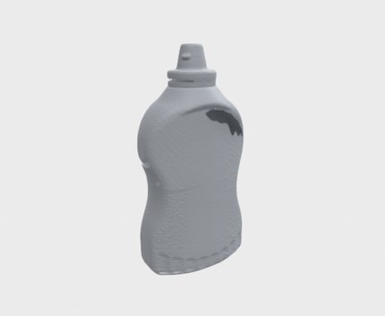 | 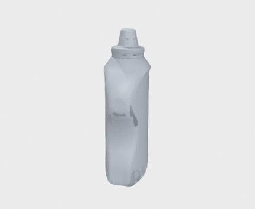 | 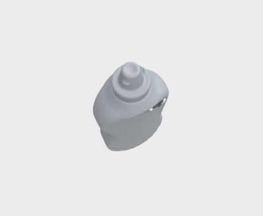 | 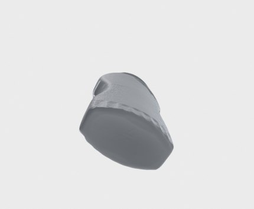 |

### hand drill
F@1mm **53.0%** · 완전성 49.4% · Chamfer 1.59mm · 205,940면 · bbox 162×52×186mm

| 정면 | 측면 | 윗면 | 아랫면 |
|---|---|---|---|
| 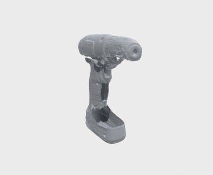 | 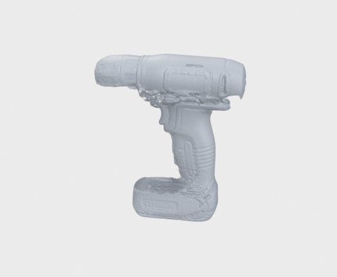 | 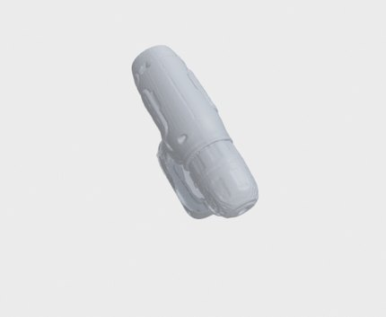 | 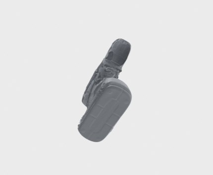 |

### alarm clock
F@1mm **71.3%** · 완전성 65.6% · Chamfer 1.04mm · 322,590면 · bbox 66×131×172mm

| 정면 | 측면 | 윗면 | 아랫면 |
|---|---|---|---|
| 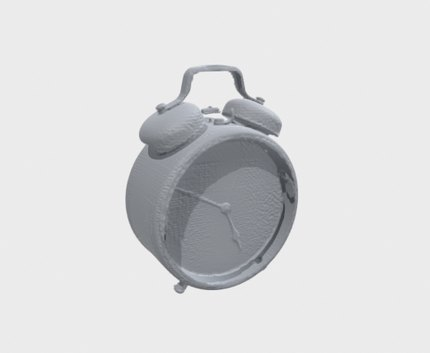 | 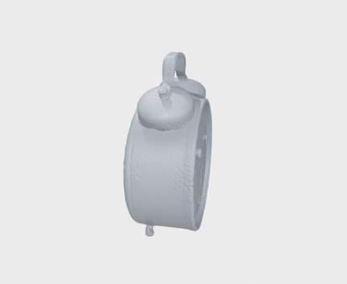 | 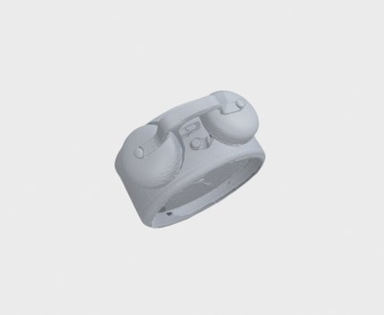 | 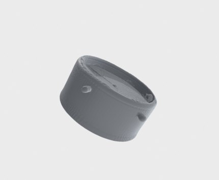 |

### spray can
F@1mm **93.8%** · 완전성 91.7% · Chamfer 0.38mm · 144,588면 · bbox 68×72×208mm

| 정면 | 측면 | 윗면 | 아랫면 |
|---|---|---|---|
| 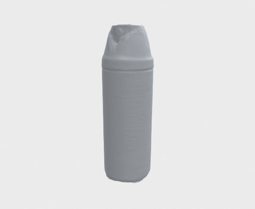 | 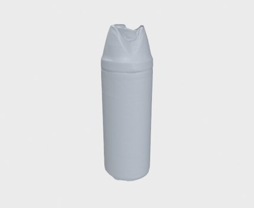 | 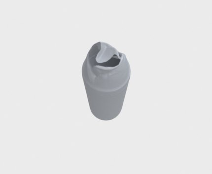 | 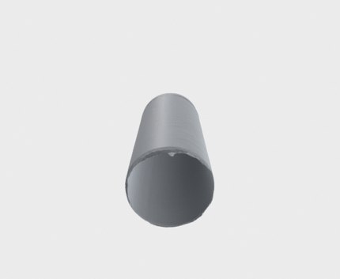 |

### mug
F@1mm **72.5%** · 완전성 60.8% · Chamfer 1.21mm · 352,104면 · bbox 97×125×80mm

| 정면 | 측면 | 윗면 | 아랫면 |
|---|---|---|---|
| 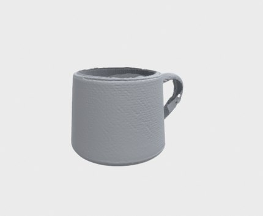 | 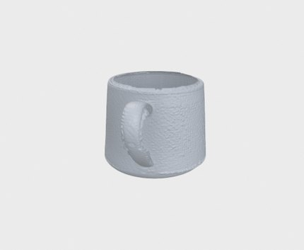 | 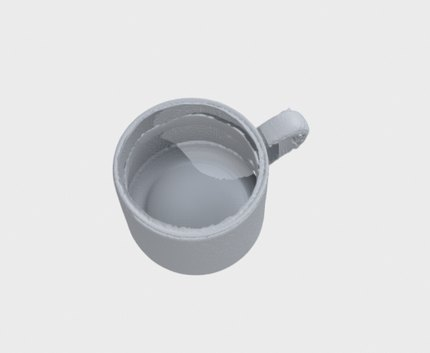 | 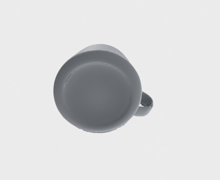 |

### laundry detergent
F@1mm **52.0%** · 완전성 54.0% · Chamfer 2.63mm · 189,609면 · bbox 195×110×306mm

| 정면 | 측면 | 윗면 | 아랫면 |
|---|---|---|---|
| 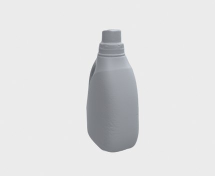 | 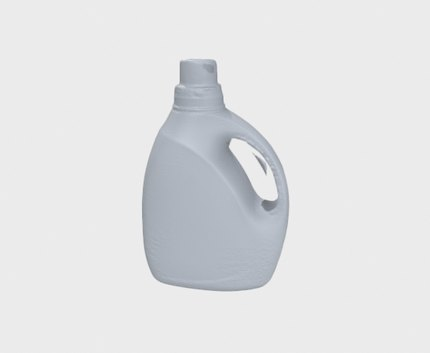 | 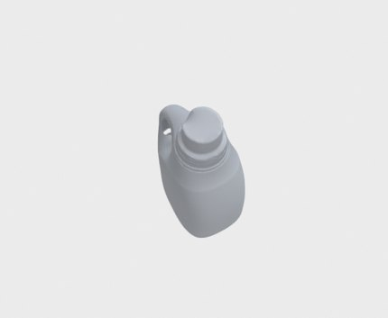 | 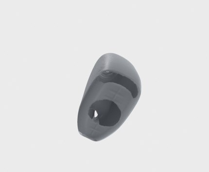 |

### drug bottle
F@1mm **99.1%** · 완전성 98.4% · Chamfer 0.26mm · 360,892면 · bbox 45×45×66mm

| 정면 | 측면 | 윗면 | 아랫면 |
|---|---|---|---|
| 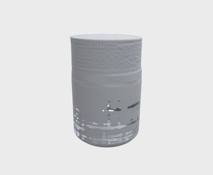 | 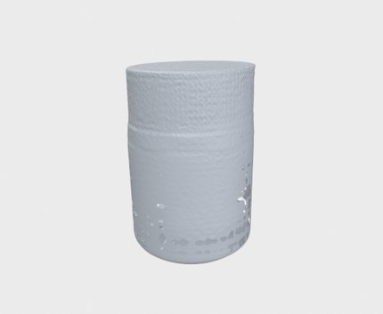 | 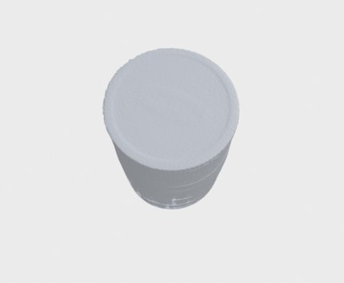 | 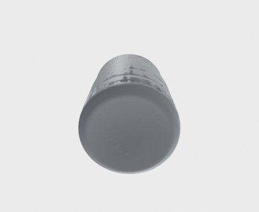 |

### povidone iodine
F@1mm **99.1%** · 완전성 98.3% · Chamfer 0.25mm · 159,158면 · bbox 33×34×90mm

| 정면 | 측면 | 윗면 | 아랫면 |
|---|---|---|---|
| 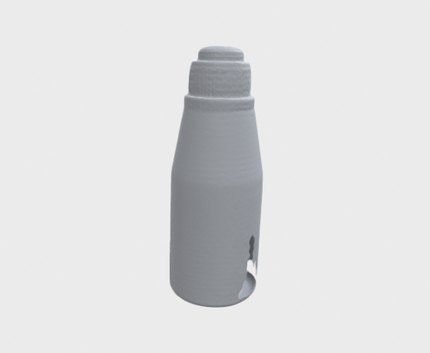 | 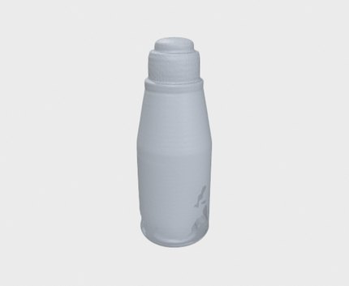 | 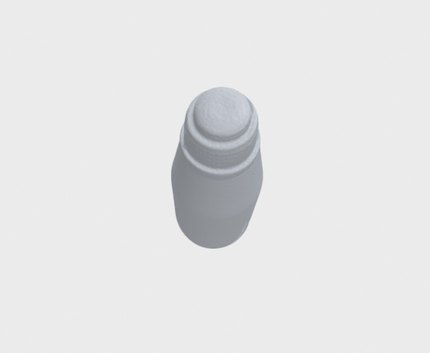 | 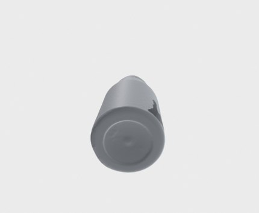 |

### protein drink
F@1mm **75.5%** · 완전성 73.4% · Chamfer 0.72mm · 185,227면 · bbox 143×56×56mm

| 정면 | 측면 | 윗면 | 아랫면 |
|---|---|---|---|
| 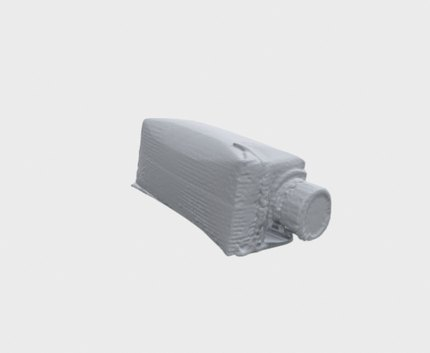 | 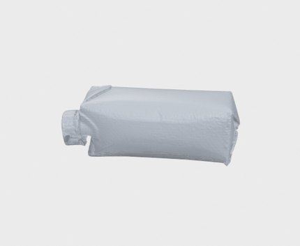 | 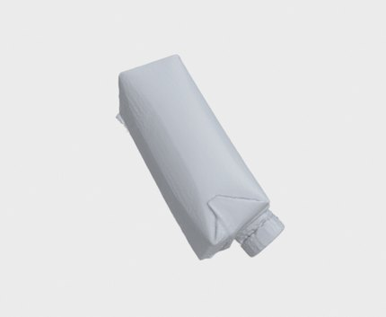 | 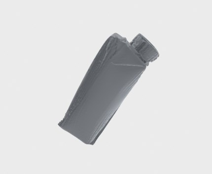 |

---

렌더: Poisson depth 8 최종 메시, 정점색 제거 + 균일 재질 (굴곡=스캔 품질). 아랫면 뷰가 Phase 3 flip 성패를 직접 보여준다. 원본 OBJ: `scripts/sim/log/*/render/<물체>.obj`, GT: `scripts/sim/log/gt/`.